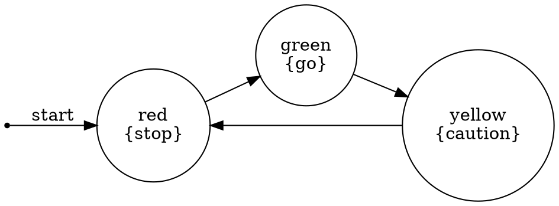

# Kripke-CTL Examples

This document provides concrete examples of using the CTL model checker.

## Example 1: Traffic Light System

### Model Description
A traffic light cycles through three states:
- Red (labeled "stop")
- Green (labeled "go")  
- Yellow (labeled "caution")

### Code Example
```go
k := CreateTrafficLightExample()
mc := NewModelChecker(k)

// Property 1: Eventually reach green light
ef_go := EF{AtomicProp{"go"}}
fmt.Printf("Can eventually reach green: %v\n", mc.Holds(ef_go))
// Output: true

// Property 2: Always eventually return to red
af_stop := AF{AtomicProp{"stop"}}
fmt.Printf("Always eventually return to red: %v\n", mc.Holds(af_stop))
// Output: true

// Property 3: Can stay green forever?
eg_go := EG{AtomicProp{"go"}}
fmt.Printf("Can stay green forever: %v\n", mc.Holds(eg_go))
// Output: false (because it cycles)

// Property 4: Never simultaneously stop and go
never_both := AG{Not{And{AtomicProp{"stop"}, AtomicProp{"go"}}}}
fmt.Printf("Never both stop and go: %v\n", mc.Holds(never_both))
// Output: true (different states)
```

### Graphviz Visualization


## Example 2: Mutual Exclusion Protocol

### Model Description
Two processes competing for a critical section:
- States encode: (process1_state, process2_state)
- Each process can be: n (non-critical), t (trying), c (critical)

### Code Example
```go
k := CreateMutualExclusionExample()
mc := NewModelChecker(k)

// Property 1: Mutual exclusion (safety)
// Never both processes in critical section
mutex := AG{Not{And{AtomicProp{"critical1"}, AtomicProp{"critical2"}}}}
fmt.Printf("Mutual exclusion holds: %v\n", mc.Holds(mutex))
// Output: true

// Property 2: Deadlock freedom
// Not stuck where both trying but neither can enter
not_stuck := Not{AG{And{AtomicProp{"trying1"}, AtomicProp{"trying2"}}}}
fmt.Printf("Not stuck (deadlock free): %v\n", mc.Holds(not_stuck))
// Output: true

// Property 3: Process 1 can enter critical section
can_enter1 := EF{AtomicProp{"critical1"}}
fmt.Printf("Process 1 can enter critical: %v\n", mc.Holds(can_enter1))
// Output: true
```

### Key Properties
1. **Safety**: `AG ¬(critical1 ∧ critical2)` - Mutual exclusion
2. **Liveness**: `AG(trying1 → AF critical1)` - No starvation (with fairness)
3. **Reachability**: `EF critical1` and `EF critical2` - Both can enter

## Example 3: Simple State Machine

### Model Description
Three states with specific transitions:
- s0 → s1 → s2 → s1 (cycle between s1 and s2)
- s0 has proposition "p"
- s1 has proposition "q"
- s2 has both "p" and "q"

### Code Example
```go
k := CreateSimpleExample()
mc := NewModelChecker(k)

// Property 1: Initial state has p
initial_p := AtomicProp{"p"}
fmt.Printf("Initial state has p: %v\n", mc.Holds(initial_p))
// Output: true

// Property 2: Eventually reach a state with q
ef_q := EF{AtomicProp{"q"}}
fmt.Printf("Eventually reach q: %v\n", mc.Holds(ef_q))
// Output: true

// Property 3: Always have p (globally)
ag_p := AG{AtomicProp{"p"}}
fmt.Printf("Always have p: %v\n", mc.Holds(ag_p))
// Output: false (s1 doesn't have p)

// Property 4: p until q (exists path)
p_until_q := EU{AtomicProp{"p"}, AtomicProp{"q"}}
fmt.Printf("p until q (exists path): %v\n", mc.Holds(p_until_q))
// Output: true (s0 has p, s1 has q)
```

## Example 4: Custom Elevator System

### Creating the Model
```go
func CreateElevatorExample() *KripkeStructure {
    k := NewKripkeStructure("floor1")
    
    // States and transitions
    k.AddTransition("floor1", "floor2")
    k.AddTransition("floor2", "floor3")
    k.AddTransition("floor3", "floor2")
    k.AddTransition("floor2", "floor1")
    k.AddTransition("floor1", "floor1")  // Can stay at ground
    
    // Labels
    k.AddLabel("floor1", "ground")
    k.AddLabel("floor1", "waiting")
    k.AddLabel("floor2", "middle")
    k.AddLabel("floor3", "top")
    
    return k
}
```

### Properties to Check
```go
k := CreateElevatorExample()
mc := NewModelChecker(k)

// 1. Can reach top floor
can_reach_top := EF{AtomicProp{"top"}}
fmt.Printf("Can reach top: %v\n", mc.Holds(can_reach_top))
// Output: true

// 2. Always can return to ground
can_return := AG{EF{AtomicProp{"ground"}}}
fmt.Printf("Can always return to ground: %v\n", mc.Holds(can_return))
// Output: true

// 3. Not stuck at top forever
not_stuck_top := Not{EG{AtomicProp{"top"}}}
fmt.Printf("Not stuck at top: %v\n", mc.Holds(not_stuck_top))
// Output: true (must come down)
```

## Example 5: Database Transaction States

### Model Definition
```go
func CreateTransactionExample() *KripkeStructure {
    k := NewKripkeStructure("idle")
    
    // States
    k.AddTransition("idle", "active")
    k.AddTransition("active", "preparing")
    k.AddTransition("preparing", "committed")
    k.AddTransition("preparing", "aborted")
    k.AddTransition("committed", "idle")
    k.AddTransition("aborted", "idle")
    
    // Labels
    k.AddLabel("idle", "ready")
    k.AddLabel("active", "writing")
    k.AddLabel("preparing", "validating")
    k.AddLabel("committed", "success")
    k.AddLabel("aborted", "failure")
    
    return k
}
```

### ACID Properties
```go
k := CreateTransactionExample()
mc := NewModelChecker(k)

// 1. Eventually completes (commits or aborts)
eventually_done := AF{Or{AtomicProp{"success"}, AtomicProp{"failure"}}}
fmt.Printf("Eventually completes: %v\n", mc.Holds(eventually_done))
// Output: true

// 2. Can succeed
can_commit := EF{AtomicProp{"success"}}
fmt.Printf("Can commit: %v\n", mc.Holds(can_commit))
// Output: true

// 3. Returns to idle after completion
returns_idle := AG{
    Implies{
        Or{AtomicProp{"success"}, AtomicProp{"failure"}},
        EX{AtomicProp{"ready"}},
    },
}
fmt.Printf("Returns to idle: %v\n", mc.Holds(returns_idle))
// Output: true
```

## Example 6: Network Protocol States

### Model with Error Handling
```go
func CreateNetworkProtocolExample() *KripkeStructure {
    k := NewKripkeStructure("disconnected")
    
    // Normal flow
    k.AddTransition("disconnected", "connecting")
    k.AddTransition("connecting", "connected")
    k.AddTransition("connected", "transmitting")
    k.AddTransition("transmitting", "connected")
    k.AddTransition("connected", "disconnecting")
    k.AddTransition("disconnecting", "disconnected")
    
    // Error paths
    k.AddTransition("connecting", "error")
    k.AddTransition("transmitting", "error")
    k.AddTransition("error", "disconnected")
    
    // Labels
    k.AddLabel("disconnected", "idle")
    k.AddLabel("connecting", "pending")
    k.AddLabel("connected", "active")
    k.AddLabel("transmitting", "active")
    k.AddLabel("transmitting", "sending")
    k.AddLabel("error", "failed")
    
    return k
}
```

### Reliability Properties
```go
k := CreateNetworkProtocolExample()
mc := NewModelChecker(k)

// 1. Can establish connection
can_connect := EF{AtomicProp{"active"}}
fmt.Printf("Can connect: %v\n", mc.Holds(can_connect))
// Output: true

// 2. Can recover from errors
can_recover := AG{Implies{AtomicProp{"failed"}, EF{AtomicProp{"active"}}}}
fmt.Printf("Can recover from errors: %v\n", mc.Holds(can_recover))
// Output: true

// 3. Not permanently stuck in error
not_stuck_error := Not{EG{AtomicProp{"failed"}}}
fmt.Printf("Not stuck in error: %v\n", mc.Holds(not_stuck_error))
// Output: true
```

## Example 7: Using OpenAI for Model Generation

### Natural Language to Model
```bash
export OPENAI_API_KEY="sk-..."
./kripke-ctl
```

Select option 4 and enter:
```
A simple vending machine. It starts in an idle state. When you insert a coin, 
it goes to a ready state. Then you can select a product and it dispenses, 
returning to idle. If you insert more coins, it can refund them.
```

The system generates:
```json
{
  "initial_state": "idle",
  "states": ["idle", "coin_inserted", "dispensing", "refunding"],
  "transitions": [
    {"from": "idle", "to": "coin_inserted"},
    {"from": "coin_inserted", "to": "dispensing"},
    {"from": "coin_inserted", "to": "refunding"},
    {"from": "dispensing", "to": "idle"},
    {"from": "refunding", "to": "idle"}
  ],
  "labels": [
    {"state": "idle", "proposition": "ready"},
    {"state": "coin_inserted", "proposition": "has_money"},
    {"state": "dispensing", "proposition": "serving"},
    {"state": "refunding", "proposition": "returning_money"}
  ]
}
```

### Checking Properties
```go
// After model is generated
mc := NewModelChecker(generatedModel)

// Can dispense product
can_dispense := EF{AtomicProp{"serving"}}
fmt.Printf("Can dispense: %v\n", mc.Holds(can_dispense))

// Always returns to idle
always_return := AG{EF{AtomicProp{"ready"}}}
fmt.Printf("Always returns to idle: %v\n", mc.Holds(always_return))
```

## Common CTL Patterns

### Pattern 1: Reachability
```go
// "Can we reach state with property p?"
reachable := EF{AtomicProp{"p"}}
```

### Pattern 2: Invariants
```go
// "Property p always holds"
invariant := AG{AtomicProp{"p"}}
```

### Pattern 3: Response
```go
// "If p happens, q eventually follows"
response := AG{Implies{AtomicProp{"p"}, AF{AtomicProp{"q"}}}}
```

### Pattern 4: Precedence
```go
// "q never happens before p"
precedence := AU{Not{AtomicProp{"q"}}, AtomicProp{"p"}}
```

### Pattern 5: Absence
```go
// "p never happens"
absence := AG{Not{AtomicProp{"p"}}}
```

### Pattern 6: Existence
```go
// "p happens at least once"
existence := EF{AtomicProp{"p"}}
```

### Pattern 7: Bounded Existence
```go
// "After p, q must happen before r"
bounded := AG{Implies{
    AtomicProp{"p"},
    AU{Not{AtomicProp{"r"}}, AtomicProp{"q"}},
}}
```

### Pattern 8: Persistence
```go
// "Once p becomes true, it stays true"
persistence := AG{Implies{AtomicProp{"p"}, AG{AtomicProp{"p"}}}}
```

## Testing Strategies

### Strategy 1: Positive Cases
Test that desired properties hold:
```go
if !mc.Holds(desiredProperty) {
    t.Error("Expected property to hold")
}
```

### Strategy 2: Negative Cases
Test that undesired properties don't hold:
```go
if mc.Holds(undesiredProperty) {
    t.Error("Expected property not to hold")
}
```

### Strategy 3: Comprehensive Coverage
Check all relevant operators on your model:
```go
operators := []CTLFormula{
    AtomicProp{"p"},
    EX{AtomicProp{"p"}},
    AX{AtomicProp{"p"}},
    EF{AtomicProp{"p"}},
    AF{AtomicProp{"p"}},
    EG{AtomicProp{"p"}},
    AG{AtomicProp{"p"}},
}

for _, op := range operators {
    result := mc.Holds(op)
    fmt.Printf("%s: %v\n", op, result)
}
```

## Visualization

Generate Graphviz output and render:
```bash
# In Go code
k.SaveGraphviz("model.dot")

# Command line
dot -Tpng model.dot -o model.png
dot -Tsvg model.dot -o model.svg
```

## Performance Considerations

For large state spaces:
1. Start with small examples
2. Use state space reduction
3. Check specific properties rather than all states
4. Consider abstraction techniques

Example of checking specific states:
```go
// Instead of checking all states
allStates := mc.Check(formula)

// Check just initial state
holds := mc.Holds(formula)
```

## Debugging Tips

### Tip 1: Visualize Your Model
Always visualize first to ensure model is correct:
```go
fmt.Println(k.GenerateGraphviz())
```

### Tip 2: Check Simpler Properties First
Build up from atomic propositions:
```go
// Start with
mc.Holds(AtomicProp{"p"})

// Then
mc.Holds(EX{AtomicProp{"p"}})

// Then more complex
mc.Holds(AG{EF{AtomicProp{"p"}}})
```

### Tip 3: Examine Satisfying States
See which states satisfy a property:
```go
states := mc.Check(formula)
for state := range states {
    fmt.Printf("State %s satisfies formula\n", state)
}
```

This comprehensive set of examples demonstrates the full capabilities of the kripke-ctl system!
