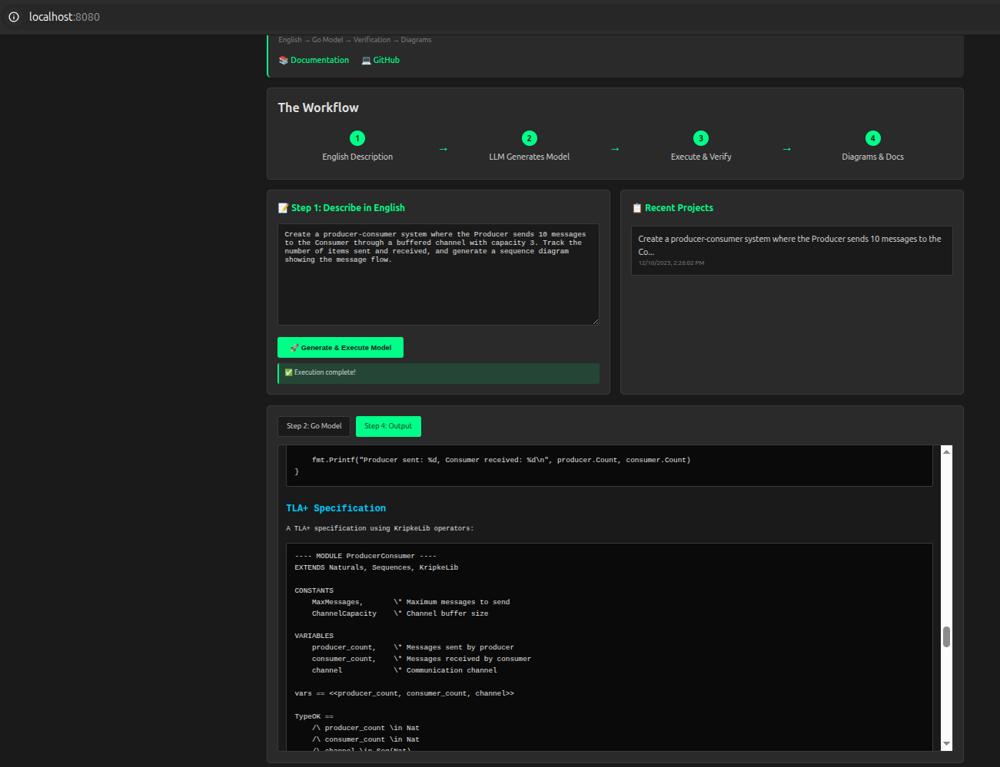

# kripke-ctl: LLM-Friendly Formal Methods for Real Systems

**Model business processes naturally, verify with CTL, generate code from verified specs.**

kripke-ctl is a formal methods toolkit designed for the LLM era. Unlike traditional model checkers (TLA+, Prism, Promela), kripke-ctl models are:
- ✅ **Natural for LLMs**: Generated from English descriptions
- ✅ **Natural for business processes**: First-class message passing, probabilistic choices
- ✅ **Natural for developers**: Written in Go, actors with state variables
- ✅ **Verification-grade**: CTL model checking, state space exploration
- ✅ **Documentation-complete**: Auto-generates diagrams, metrics, requirements tables

## The Problem with Existing Tools

### TLA+ 
❌ **Unnatural for business processes**
- Global state (no separate actor instances)
- No first-class message passing
- No probability/chance nodes

### Prism
❌ **Tooling issues**
- UI and CLI parsers are different (!)
- Complex syntax for simple patterns
- No natural message passing

### Promela (SPIN)
❌ **Similar limitations to TLA+**
- Message passing is verbose
- Limited probabilistic support
- Models don't inform implementation

## The kripke-ctl Solution

### The Workflow

```
English Description
    ↓
LLM generates kripke-ctl model
    ↓
Verify with CTL (safety, liveness, fairness)
    ↓
Commit verified model to repo
    ↓
LLM generates implementation from model
    ↓
Verified software
```



### Key Innovation: Models ARE the Requirements

Traditional approach:
```
Requirements (English) → Model (TLA+) → Code (Python/Go)
                           ↑________________↑
                        disconnected!
```

kripke-ctl approach:
```
English → kripke model → Code
          ↑________________↑
          same language (Go)!
```

The model **is** the primary description for generating software. The LLM reads your verified kripke model and generates implementation code that matches the verified behavior.

## Why kripke-ctl?

### 1. Actor-Based State Machines

Actors have their own state variables - no global state soup:

```go
type Uploader struct {
    id             string
    chunksSent     int       // State variable
    totalBytesSent int64     // State variable
}

type Receiver struct {
    id                string
    chunksReceived    int       // State variable
    totalBytesReceived int64     // State variable
}
```

State = `{chunksSent: 5, totalBytesSent: 5242880}`

### 2. First-Class Message Passing

Built-in message passing primitives:

```go
// Send message
SendMessage(w, Message{
    From: Address{ActorID: "uploader", ChannelName: "out"},
    To:   Address{ActorID: "receiver", ChannelName: "inbox"},
    Payload: "chunk_data",
})

// Receive message
msg, delay := RecvAndLog(w, inbox)
```

Channels have capacity, blocking semantics - just like Go.

### 3. Chance Nodes (Probabilistic Decisions)

Model real-world uncertainty:

```go
func (c *Client) Ready(w *World) []Step {
    return []Step{
        func(w *World) {
            if rand() < 0.7 {
                sendSmallRequest()  // 70%
            } else {
                sendLargeRequest()  // 30%
            }
        },
    }
}
```

This is an **MDP** (Markov Decision Process), not a Markov Chain:
- Actions chosen by scheduler (nondeterministic)
- Outcomes probabilistic via chance nodes
- Perfect for modeling business processes with uncertainty

### 4. Guards and Actions

Natural state machine syntax:

```go
func (p *Producer) Ready(w *World) []Step {
    // Guard 1: NOT blocked on send?
    if !ch.CanSend() {
        return nil
    }
    
    // Guard 2: Variable predicate
    if p.itemsSent >= p.maxItems {
        return nil
    }
    
    // Action: send + edit variables
    return []Step{
        func(w *World) {
            SendMessage(w, msg)
            p.itemsSent++              // Variable edit
            p.totalBytesSent += 1024   // Variable edit
        },
    }
}
```

Guards enable transitions. Actions modify state via:
1. Variable edits
2. Send message
3. Receive message

### 5. Auto-Generated Documentation

Every model generates:
- **State diagrams** (Mermaid): Visual state machines
- **Sequence diagrams** (Mermaid): Message flows
- **Metrics tables**: Counters, throughput, delays
- **CTL verification tables**: PASS/FAIL for requirements
- **Requirements tables**: Traceability

No manual documentation needed!

## Example: File Upload System

### English Description (Input to LLM)

> "Create a file upload system where an Uploader sends 10 chunks (1MB each) to a Receiver through a buffered channel (capacity 3). Track total bytes sent/received and calculate throughput."

### LLM Generates kripke Model

```go
package main

import (
    "github.com/rfielding/kripke-ctl/kripke"
    "time"
)

type Uploader struct {
    id             string
    chunksSent     int
    maxChunks      int
    totalBytesSent int64
    startTime      time.Time
}

func (u *Uploader) ID() string { return u.id }

func (u *Uploader) Ready(w *kripke.World) []kripke.Step {
    ch := w.ChannelByAddress(kripke.Address{ActorID: "receiver", ChannelName: "inbox"})
    if ch == nil || !ch.CanSend() || u.chunksSent >= u.maxChunks {
        return nil
    }
    
    return []kripke.Step{
        func(w *kripke.World) {
            kripke.SendMessage(w, kripke.Message{
                From:    kripke.Address{ActorID: u.id, ChannelName: "out"},
                To:      kripke.Address{ActorID: "receiver", ChannelName: "inbox"},
                Payload: fmt.Sprintf("chunk_%d", u.chunksSent),
            })
            u.chunksSent++
            u.totalBytesSent += 1024 * 1024
        },
    }
}

// Receiver actor...
type Receiver struct { /* ... */ }

func main() {
    uploader := &Uploader{id: "uploader", maxChunks: 10, startTime: time.Now()}
    receiver := &Receiver{id: "receiver", inbox: inbox, startTime: time.Now()}
    
    w := kripke.NewWorld(
        []kripke.Process{uploader, receiver},
        []*kripke.Channel{inbox},
        42,
    )
    
    // Run and verify
    for w.StepRandom() { }
    
    // Generate documentation
    diagram := w.GenerateSequenceDiagram(20)
    throughput := kripke.CalculateThroughput(uploader.totalBytesSent, startTime, endTime)
}
```

### Model Generates

- ✅ Sequence diagram showing all message exchanges
- ✅ State machine with variables
- ✅ Metrics: bytes sent/received, chunks, delays
- ✅ Throughput: 24.5 MB/s
- ✅ Verification: No deadlocks, all chunks delivered

### LLM Generates Implementation from Model

Now the LLM uses the **verified model** as the source of truth to generate production code:

```go
// Production implementation matches verified model behavior
type UploaderService struct {
    chunksSent     atomic.Int64
    totalBytesSent atomic.Int64
}

func (u *UploaderService) Upload(ctx context.Context, chunks [][]byte) error {
    for _, chunk := range chunks {
        if u.chunksSent.Load() >= maxChunks {
            return nil
        }
        
        if err := u.sendChunk(ctx, chunk); err != nil {
            return err
        }
        
        u.chunksSent.Add(1)
        u.totalBytesSent.Add(int64(len(chunk)))
    }
    return nil
}
```

The implementation follows the verified model's behavior!

## Features

### For Business Process Modeling

- ✅ **Multiple actor instances**: Easy to model systems with many participants
- ✅ **First-class messaging**: Channels with capacity, blocking, delays
- ✅ **Probabilistic choices**: Chance nodes for uncertainty (90% success, 10% failure)
- ✅ **State variables**: Natural representation (not abstract state tuples)
- ✅ **Metrics tracking**: Counters, throughput, latencies built-in

### For Verification

- ✅ **CTL model checking**: Safety, liveness, fairness properties
- ✅ **State space exploration**: Uniform random scheduling explores interleavings
- ✅ **Deadlock detection**: System quiesces when no actors ready
- ✅ **Requirements traceability**: Link CTL formulas to English requirements

### For LLM Integration

- ✅ **Natural syntax**: Go code, not obscure formal notation
- ✅ **English → Model**: LLMs can generate models from descriptions
- ✅ **Model → Code**: LLMs can generate implementation from models
- ✅ **Auto-documentation**: Diagrams and tables for humans to review

### For Developers

- ✅ **Real programming language**: Go, with full tooling
- ✅ **Testable**: Standard Go tests
- ✅ **Debuggable**: Print statements, debuggers work
- ✅ **Libraries**: Use any Go package (JSON, HTTP, crypto, etc.)

## Installation

```bash
# Get the library
go get github.com/rfielding/kripke-ctl

# Install recent additions
cd kripke-ctl
tar xzf kripke-additions.tar.gz
cp kripke-additions/diagrams.go kripke/
cp kripke-additions/metrics.go kripke/
```

## Quick Start

See `examples/` for complete working examples:
- `producer_consumer.go` - Basic pattern
- `upload_system.go` - Throughput tracking
- `workflow_system.go` - Chance nodes + distributions

```bash
cd examples
go run producer_consumer.go
# Generates: producer-consumer-output.md with diagrams
```

## Use Cases

### 1. Distributed Systems

Model consensus protocols, replication, message passing:
- Multiple nodes with state
- Network partitions (probabilistic)
- Message delays and reordering
- Leader election, quorum voting

### 2. Business Workflows

Model approval chains, request routing, SLAs:
- Multiple actors (users, services, systems)
- Probabilistic outcomes (80% approve, 20% reject)
- Timeouts and retries
- Metrics (throughput, latency, success rate)

### 3. API Design

Model client-server interactions before building:
- Request/response patterns
- Rate limiting
- Error handling (retry logic, backoff)
- Load distribution

### 4. Cloud Infrastructure

Model service interactions, autoscaling, failover:
- Services with state
- Health checks
- Traffic routing
- Resource allocation

## Documentation

- **docs/COMPLETE_VISION.md** - Full vision and workflow
- **docs/ACTOR_READINESS_MODEL.md** - Actor scheduling model
- **docs/WHY_CHANCE_NODES.md** - Design rationale (MDP vs Markov Chains)
- **docs/PROPER_ARCHITECTURE.md** - Library architecture
- **docs/INTEGRATION_GUIDE.md** - Step-by-step integration

## Comparison with Alternatives

| Feature | TLA+ | Prism | Promela | kripke-ctl |
|---------|------|-------|---------|------------|
| **Actor instances** | Difficult | Manual | Manual | Easy: `[]Process{a,b,c}` |
| **Message passing** | Manual | No | Verbose | Built-in |
| **Probability** | No | Yes | Limited | Yes (chance nodes) |
| **State** | Global | Global | Global | Per-actor variables |
| **Syntax** | Custom | Custom | Custom | Go (standard) |
| **LLM-friendly** | ❌ | ❌ | ❌ | ✅ |
| **Auto-diagrams** | No | No | No | Yes (Mermaid) |
| **Metrics** | No | No | No | Yes (built-in) |
| **Model = Code** | No | No | No | Yes (same language) |

## The LLM Workflow in Practice

### Step 1: English Requirements

```
Create a distributed key-value store with:
- 3 replica nodes
- Quorum reads (2/3) and writes (2/3)
- Network delays (10-50ms)
- 5% network partition probability
- Track consistency and availability metrics
```

### Step 2: LLM Generates kripke Model

The LLM creates:
```go
type ReplicaNode struct {
    id       string
    data     map[string]string  // State variable
    version  int                // State variable
}

type Client struct {
    readsIssued  int  // State variable
    writesIssued int  // State variable
    readLatency  []int
}

// ... Ready() methods with guards and actions
// ... Chance nodes for network delays and partitions
```

### Step 3: Run and Verify

```bash
go run kvstore_model.go
```

Generates:
- State space exploration report
- CTL verification results (consistency properties)
- Sequence diagram (message flows)
- Metrics (availability: 99.8%, consistency violations: 0)

### Step 4: Commit Verified Model

```bash
git add kvstore_model.go kvstore-output.md
git commit -m "Verified KV store model: 3 replicas, quorum, 99.8% availability"
```

### Step 5: LLM Generates Implementation

The LLM now reads the **verified model** and generates production code:

```go
// Implementation follows verified model structure
type Replica struct {
    id       string
    data     sync.Map  // Matches model's data map
    version  atomic.Int32  // Matches model's version counter
}

// Implementation follows verified message patterns
func (r *Replica) HandleWrite(key, value string) error {
    // Quorum logic matches verified model
    responses := r.broadcastWrite(key, value)
    if len(responses) >= 2 {  // Quorum of 2/3
        r.data.Store(key, value)
        r.version.Add(1)
        return nil
    }
    return ErrNoQuorum
}
```

The model **informed** the implementation!

## Why This Matters

Traditional workflow:
```
Requirements → Model (TLA+) → [gap] → Implementation (Go)
                              ↑____↑
                         disconnected!
```

kripke-ctl workflow:
```
Requirements → Model (Go + kripke) → Implementation (Go)
               ↑___________________________________↑
                      same language!
```

Benefits:
1. **No impedance mismatch**: Model and code use same concepts
2. **LLM can generate both**: From English to model to code
3. **Verification informs implementation**: Properties carry over
4. **Living documentation**: Model IS the spec
5. **Incremental refinement**: Model → Skeleton → Implementation

## Project Status

**Active development**. Core features complete:
- ✅ Actor-based state machines
- ✅ First-class message passing
- ✅ CTL model checking
- ✅ Chance nodes (MDP)
- ✅ Diagram generation (Mermaid)
- ✅ Metrics and observability
- ✅ Working examples

Coming soon:
- [ ] More CTL temporal operators
- [ ] Counterexample generation
- [ ] Fairness constraints
- [ ] Symbolic execution
- [ ] Integration with LLM APIs

## Contributing

Contributions welcome! Areas of interest:
- More example models (distributed systems, business processes)
- Additional CTL operators
- Visualization improvements
- LLM prompt engineering for model generation
- Integration with testing frameworks

## License

MIT License - see LICENSE file

## Citation

If you use kripke-ctl in research:

```bibtex
@software{kripke-ctl,
  title = {kripke-ctl: LLM-Friendly Formal Methods for Real Systems},
  author = {Fielding, Robert},
  year = {2024},
  url = {https://github.com/rfielding/kripke-ctl}
}
```

## Learn More

- **Blog post**: "Why Formal Methods Need to Speak LLM" (coming soon)
- **Examples**: See `examples/` directory
- **Documentation**: See `docs/` directory
- **Issues**: GitHub issues for questions and discussions

---

**kripke-ctl**: Model business processes naturally. Verify with CTL. Generate code from verified specs.

*Because the future of formal methods is natural language.*
