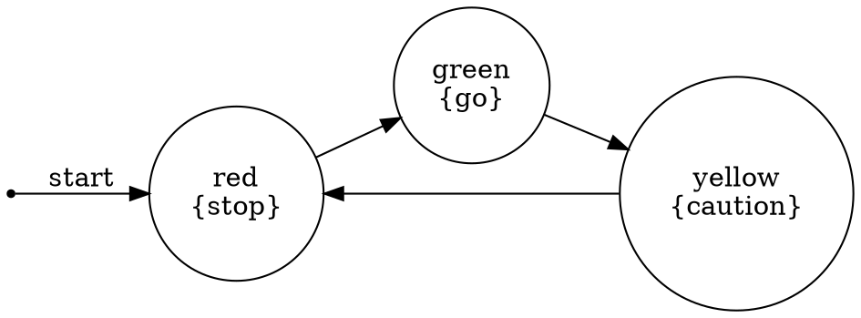

# Kripke-CTL Usage Guide

## Quick Start

### Building and Running

```bash
go build -o kripke-ctl
./kripke-ctl
```

## Interactive CLI Walkthrough

### 1. Traffic Light Example

When you run the program, select option 1 for the Traffic Light example:

```
Options:
1. Use predefined example (Traffic Light)
2. Use predefined example (Mutual Exclusion)
3. Use predefined example (Simple)
5. Exit

Select option: 1
```

Output:
```
=== Traffic Light Model ===
Kripke Structure:
  Initial State: red
  States: [red green yellow]
  Transitions:
    red -> green
    green -> yellow
    yellow -> red
  Labeling:
    red: [stop]
    green: [go]
    yellow: [caution]
```

The system automatically checks some example properties:

```
Initial state satisfies 'go': false
EF go (eventually go): true
AG caution (always caution): false
```

Select option 1 to check all predefined formulas:

```
Checking formulas in initial state:
  p (atomic): false
  EX p (exists next p): true
  AX p (all next p): true
  EF p (eventually p): true
  AF p (always eventually p): true
  EG p (exists always p): false
  AG p (always p): false
  E[p U q] (p until q): false
```

### 2. Mutual Exclusion Example

This demonstrates a classic mutual exclusion protocol:

```
=== Mutual Exclusion Model ===
Kripke Structure:
  Initial State: n1n2
  States: [n1n2 t1n2 c1n2 n1t2 n1c2 t1t2 c1t2 t1c2]
  Transitions:
    n1n2 -> t1n2
    n1n2 -> n1t2
    t1n2 -> c1n2
    ...
  Labeling:
    c1n2: [critical1]
    n1c2: [critical2]
    ...
```

States are encoded as:
- `n1n2` - both processes in non-critical section
- `t1n2` - process 1 trying, process 2 in non-critical
- `c1n2` - process 1 in critical, process 2 in non-critical
- etc.

Key property: `AG ¬(critical1 ∧ critical2)` ensures mutual exclusion.

### 3. OpenAI Integration (requires API key)

Set your OpenAI API key:
```bash
export OPENAI_API_KEY="sk-..."
./kripke-ctl
```

Select option 4:
```
Options:
1. Use predefined example (Traffic Light)
2. Use predefined example (Mutual Exclusion)
3. Use predefined example (Simple)
4. Generate model from English description (OpenAI)
5. Exit

Select option: 4
```

Example prompt:
```
Describe the system in English: A simple door that can be open or closed, 
with a lock. The door starts closed and locked. You can unlock it, then open it, 
or lock it again.
```

The system generates a Kripke structure from your description and allows you to check properties.

## CTL Formula Examples

### Traffic Light Properties

1. **Safety**: The light is never stuck
   - `EF go` - Eventually reach green
   - `EF stop` - Eventually reach red

2. **Liveness**: The system makes progress
   - `AF stop` - Always eventually return to red
   - `AF go` - Always eventually reach green

3. **State properties**
   - `AG (stop → AX ¬stop)` - After red, next state is not red
   - `EG go` - Can stay green forever? (false for cycling traffic light)

### Mutual Exclusion Properties

1. **Safety** (Mutual Exclusion)
   - `AG ¬(critical1 ∧ critical2)` - Never both in critical section

2. **Liveness** (No Starvation)
   - `AG (trying1 → AF critical1)` - If trying, eventually enter critical
   - `AG (trying2 → AF critical2)` - Same for process 2

3. **Progress**
   - `EF critical1` - Process 1 can enter critical section
   - `EF critical2` - Process 2 can enter critical section

### Generic Patterns

1. **Reachability**
   - `EF φ` - State satisfying φ is reachable
   - `AF φ` - State satisfying φ will eventually be reached

2. **Invariants**
   - `AG φ` - φ always holds
   - `AG (p → q)` - Whenever p holds, q also holds

3. **Liveness**
   - `AG (p → EF q)` - Whenever p holds, q will eventually hold
   - `AG (p → AF q)` - Whenever p holds, q must eventually hold on all paths

4. **Fairness**
   - `AG EF φ` - φ holds infinitely often on some path
   - `AG AF φ` - φ holds infinitely often on all paths

## Programming API

### Creating a Kripke Structure

```go
k := NewKripkeStructure("initial")

// Add states and transitions
k.AddTransition("initial", "next")
k.AddTransition("next", "final")

// Add labels
k.AddLabel("initial", "ready")
k.AddLabel("final", "done")
```

### Model Checking

```go
mc := NewModelChecker(k)

// Define a formula
formula := AF{AtomicProp{"done"}}

// Check if it holds in the initial state
result := mc.Holds(formula)

// Or get all states where it holds
states := mc.Check(formula)
```

### Available CTL Constructors

```go
// Atomic propositions
AtomicProp{Proposition("p")}

// Boolean operators
Not{formula}
And{left, right}
Or{left, right}
Implies{left, right}

// Temporal operators
EX{formula}  // Exists Next
AX{formula}  // All Next
EF{formula}  // Exists Finally
AF{formula}  // All Finally
EG{formula}  // Exists Globally
AG{formula}  // All Globally
EU{left, right}  // Exists Until
AU{left, right}  // All Until

// Constants
True{}
False{}
```

## Visualization

Generate Graphviz DOT output:

```go
k := CreateTrafficLightExample()
dot := k.GenerateGraphviz()
// Save to file or render with Graphviz
```

Example DOT output:


Render with Graphviz:
```bash
./kripke-ctl # ... generate DOT output
dot -Tpng -o traffic_light.png traffic_light.dot
```

## Testing

Run the test suite:

```bash
go test -v
```

Run specific test:
```bash
go test -v -run TestTrafficLightSafety
```

Run with coverage:
```bash
go test -cover
```

## Advanced Usage

### Custom Model Creation

Create your own models programmatically:

```go
func CreateElevatorSystem() *KripkeStructure {
    k := NewKripkeStructure("floor1")
    
    // Add floors
    k.AddTransition("floor1", "floor2")
    k.AddTransition("floor2", "floor3")
    k.AddTransition("floor3", "floor2")
    k.AddTransition("floor2", "floor1")
    
    // Add labels
    k.AddLabel("floor1", "ground")
    k.AddLabel("floor1", "doors_open")
    k.AddLabel("floor2", "middle")
    k.AddLabel("floor3", "top")
    
    return k
}
```

### Property Verification

```go
elevator := CreateElevatorSystem()
mc := NewModelChecker(elevator)

// Can reach the top floor
canReachTop := mc.Holds(EF{AtomicProp{"top"}})

// Always eventually return to ground
alwaysReturnGround := mc.Holds(AG{EF{AtomicProp{"ground"}}})

// Never stuck at top floor forever
notStuckAtTop := !mc.Holds(EG{AtomicProp{"top"}})
```

## Common Patterns

### Checking Multiple Properties

```go
properties := []struct {
    name    string
    formula CTLFormula
}{
    {"Safety", AG{Not{AtomicProp{"error"}}}},
    {"Liveness", AF{AtomicProp{"goal"}}},
    {"Reachability", EF{AtomicProp{"state"}}},
}

for _, prop := range properties {
    result := mc.Holds(prop.formula)
    fmt.Printf("%s: %v\n", prop.name, result)
}
```

### Debugging Failed Properties

When a property doesn't hold, examine which states satisfy it:

```go
formula := AG{AtomicProp{"safe"}}
states := mc.Check(formula)

fmt.Println("States satisfying formula:")
for state := range states {
    fmt.Printf("  %s\n", state)
}

if !states[k.InitialState] {
    fmt.Println("Property does not hold in initial state")
}
```

## Troubleshooting

### OpenAI Integration Issues

1. **API Key not recognized**
   ```bash
   export OPENAI_API_KEY="your-key-here"
   echo $OPENAI_API_KEY  # Verify it's set
   ```

2. **Rate limiting**
   - OpenAI has rate limits; wait a moment between requests
   - Use predefined examples for testing without API calls

3. **Parsing errors**
   - The AI might generate invalid JSON
   - Try rephrasing your description
   - Use simpler system descriptions

### Model Checking Performance

For large state spaces:
- Consider state space reduction techniques
- Use predicate abstraction
- Focus on specific properties rather than exhaustive checking

### Formula Complexity

Complex formulas may take longer to evaluate:
- Nested temporal operators increase computation
- Start with simple properties
- Break complex properties into simpler sub-properties

## Best Practices

1. **Start Simple**: Begin with basic properties before complex ones
2. **Validate Models**: Ensure your Kripke structure represents your system correctly
3. **Use Examples**: Learn from predefined examples
4. **Test Incrementally**: Add one state/transition at a time
5. **Document Properties**: Clearly state what each formula checks
6. **Leverage OpenAI**: Use natural language for rapid prototyping

## Further Reading

- [CTL Model Checking](https://en.wikipedia.org/wiki/Computation_tree_logic)
- [Temporal Logic](https://en.wikipedia.org/wiki/Temporal_logic)
- [Model Checking Textbook](http://www.cs.cmu.edu/~emc/)
- [Kripke Structures](https://en.wikipedia.org/wiki/Kripke_structure_(model_checking))
