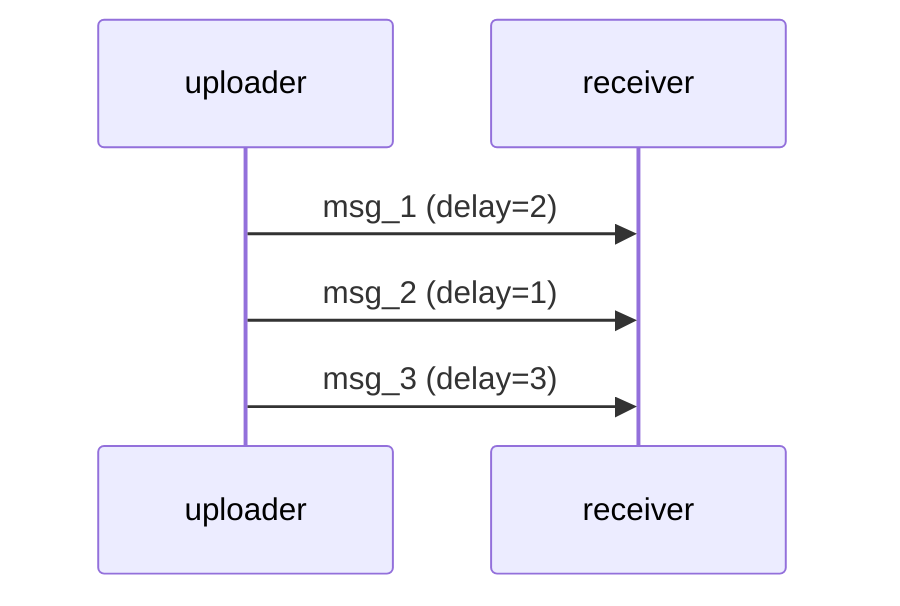
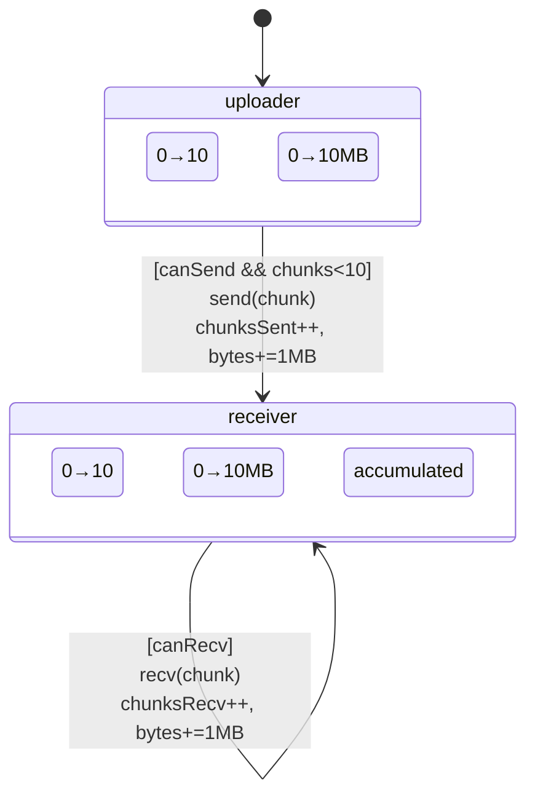
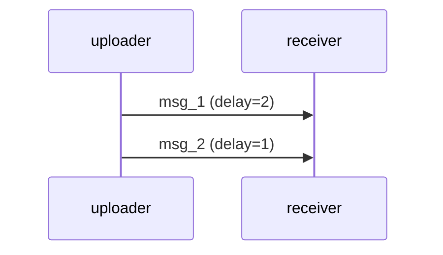
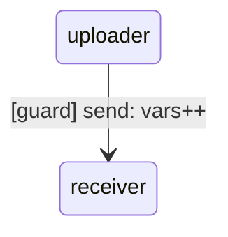
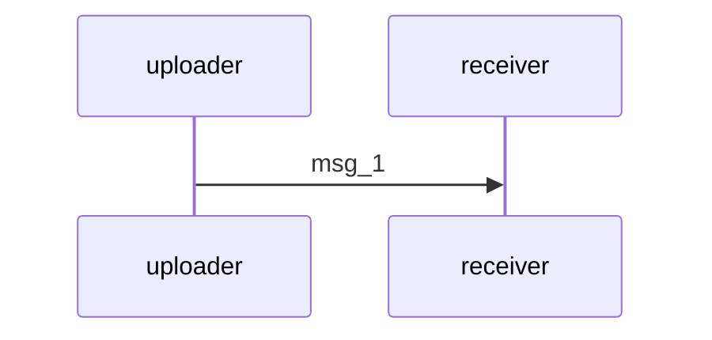

# Complete Vision: LLM → Go + kripke Library → Diagrams

## The Workflow

```
┌─────────────────────────────────────────────────────────┐
│ 1. ENGLISH PROMPT (Human Input)                         │
│    "Create file upload system with throughput tracking" │
└─────────────────┬───────────────────────────────────────┘
                  ↓
┌─────────────────────────────────────────────────────────┐
│ 2. LLM GENERATES GO CODE                                │
│    - Imports: github.com/rfielding/kripke-ctl/kripke   │
│    - Defines actors with state variables                │
│    - Implements Ready() with guards and actions         │
└─────────────────┬───────────────────────────────────────┘
                  ↓
┌─────────────────────────────────────────────────────────┐
│ 3. GO CODE CALLS KRIPKE LIBRARY                         │
│    - GenerateActorStateTable()                          │
│    - GenerateTransitionTable()                          │
│    - GenerateInteractionDiagram()                       │
│    - GenerateMetricsTable()                             │
└─────────────────┬───────────────────────────────────────┘
                  ↓
┌─────────────────────────────────────────────────────────┐
│ 4. LIBRARY GENERATES ALL DIAGRAMS                       │
│    - State machine (CODE as states)                     │
│    - Interaction diagram (message exchanges)            │
│    - Metrics charts (counters, throughput)              │
└─────────────────────────────────────────────────────────┘
```

---

## Core Concepts

### 1. States = Actor Code (Variables)

**Not abstract states** like `buffer_0`, `buffer_1`

**Actual actor instances** with their variables:

```go
type Uploader struct {
    id             string
    chunksSent     int      // State variable
    totalBytesSent int64    // State variable
    startTime      time.Time
}
```

**State = Value of all variables**:
- State₁: `{chunksSent: 0, totalBytesSent: 0}`
- State₂: `{chunksSent: 1, totalBytesSent: 1048576}`
- State₃: `{chunksSent: 2, totalBytesSent: 2097152}`

### 2. State Changes = Variable Edits

**Not explicit state tuples**

**Variable assignments change state**:

```go
// Action that changes state:
u.chunksSent++              // chunksSent' = chunksSent + 1
u.totalBytesSent += 1048576 // totalBytesSent' = totalBytesSent + 1MB
```

**TLA+ style**:
```tla
chunksSent' = chunksSent + 1
totalBytesSent' = totalBytesSent + 1048576
```

### 3. Transitions = Guards + Actions

**Guard** (predicate enables transition):
```go
func (u *Uploader) Ready(w *World) []Step {
    if !ch.CanSend() || u.chunksSent >= 10 {
        return nil  // Guard failed, transition disabled
    }
    // Guard passed, return action
}
```

**Action** (modifies state):
```go
return []Step{
    func(w *World) {
        SendMessage(...)       // Send message
        u.chunksSent++        // Edit variable
        u.totalBytesSent += 1MB  // Edit variable
    },
}
```

### 4. Three Types of Actions

As you specified:

1. **Modify variables**: `x' = x + 1`
2. **Send message**: `SendMessage(w, msg)`
3. **Recv message**: `RecvAndLog(w, channel)`

```go
// Action 1: Variable edit
u.chunksSent++

// Action 2: Send
SendMessage(w, kripke.Message{
    From: Address{ActorID: "uploader", ChannelName: "out"},
    To:   Address{ActorID: "receiver", ChannelName: "inbox"},
    Payload: "chunk_0",
})

// Action 3: Recv
msg, delay := RecvAndLog(w, r.inbox)
```

### 5. Interaction Diagram = Execution Result

**Not hand-drawn** or abstract

**Generated from actual run**:

```go
w := NewWorld(actors, channels, seed)

// Run system
for i := 0; i < 100; i++ {
    w.StepRandom()  // Actual execution
}

// Generate diagram from what actually happened
diagram := w.GenerateInteractionDiagram(10)
```

Output shows **real message exchanges** that occurred:



### 6. Observability = Counters

Track metrics during execution:

```go
metrics := NewMetricsCollector()

uploadBytes := metrics.Counter("upload_bytes", "Total uploaded", "bytes")
uploadTime := metrics.Counter("upload_time", "Total time", "ms")

// During execution:
uploadBytes.Add(1048576)  // +1 MB
uploadTime.Add(42)        // +42 ms

// Calculate throughput:
throughput := CalculateThroughput(totalBytes, startTime, endTime)
// Returns: 24.5 MB/s
```

---

## State Machine Rendering

### Shows CODE States



**Edge labels show**:
- **Guard**: `[canSend && chunks<10]`
- **Action**: `send(chunk)`
- **Variable edits**: `chunksSent++, bytes+=1MB`

---

## Why Not TLA+?

### TLA+ Limitations

| Feature | TLA+ | kripke Library |
|---------|------|----------------|
| **Actor instantiation** | ❌ Difficult | ✅ Easy: `actors := []Process{a1, a2, a3}` |
| **Message passing** | ❌ Not first-class | ✅ Built-in: `SendMessage()`, `RecvAndLog()` |
| **Separate actors** | ❌ Global state | ✅ Each actor has own state |
| **Chance nodes** | ❌ No probability | ✅ `if rand() < 0.5 { ... }` |
| **Observability** | ❌ No counters | ✅ Metrics, throughput, latency |
| **Diagrams** | ❌ Manual/external | ✅ Auto-generated from code |

### TLA+ Example (Cumbersome)

```tla
EXTENDS Naturals, Sequences

VARIABLES 
    uploader,    \* Record with fields
    receiver,    \* Record with fields
    channel      \* Sequence of messages

Init ==
    /\ uploader = [chunksSent |-> 0, totalBytesSent |-> 0]
    /\ receiver = [chunksReceived |-> 0, totalBytesReceived |-> 0]
    /\ channel = <<>>

Upload ==
    /\ uploader.chunksSent < 10
    /\ Len(channel) < 3
    /\ uploader' = [uploader EXCEPT 
                    !.chunksSent = @ + 1,
                    !.totalBytesSent = @ + 1048576]
    /\ channel' = Append(channel, "chunk")
    /\ UNCHANGED receiver

Download ==
    /\ Len(channel) > 0
    /\ receiver' = [receiver EXCEPT
                    !.chunksReceived = @ + 1,
                    !.totalBytesReceived = @ + 1048576]
    /\ channel' = Tail(channel)
    /\ UNCHANGED uploader

Next == Upload \/ Download
```

**Problems**:
1. Global state (uploader, receiver in same namespace)
2. Manual channel management
3. No probability/chance nodes
4. No metrics/observability
5. Diagrams must be drawn separately

### kripke Library (Clean)

```go
type Uploader struct {
    id             string
    chunksSent     int
    totalBytesSent int64
}

func (u *Uploader) Ready(w *World) []Step {
    if !ch.CanSend() || u.chunksSent >= 10 {
        return nil
    }
    return []Step{
        func(w *World) {
            SendMessage(w, msg)
            u.chunksSent++
            u.totalBytesSent += 1048576
        },
    }
}
```

**Benefits**:
1. Separate actor instances
2. Built-in message passing
3. Can add probability: `if rand() < 0.5`
4. Metrics automatically tracked
5. Diagrams auto-generated

---

## Library Methods (kripke Package)

### Method 1: GenerateActorStateTable()

```go
func GenerateActorStateTable(states []ActorState) string
```

**Input**: Actor states (variables)

**Output**: Markdown table

```markdown
| Actor | State Variables |
|-------|-----------------|
| uploader | chunksSent=10, totalBytesSent=10485760 |
| receiver | chunksReceived=10, totalBytesReceived=10485760 |
```

### Method 2: GenerateTransitionTable()

```go
func GenerateTransitionTable(transitions []StateTransition) string
```

**Input**: Transitions with guards and actions

**Output**: Markdown table

```markdown
| From | To | Guard | Action | Variable Changes |
|------|----|-------|--------|------------------|
| uploader | receiver | `canSend && chunks<10` | send(chunk) | chunksSent++, bytes+=1MB |
```

### Method 3: GenerateInteractionDiagram()

```go
func (w *World) GenerateInteractionDiagram(maxEvents int) string
```

**Input**: World with execution history

**Output**: Mermaid sequence diagram



### Method 4: GenerateMetricsTable()

```go
func (mc *MetricsCollector) GenerateMetricsTable() string
```

**Input**: Metrics collector with counters

**Output**: Markdown table

```markdown
| Metric | Type | Value | Unit | Description |
|--------|------|-------|------|-------------|
| upload_bytes | counter | 10485760 | bytes | Total uploaded |
| upload_chunks | counter | 10 | chunks | Total chunks |
```

### Method 5: GenerateThroughputTable()

```go
func GenerateThroughputTable(throughputs map[string]Throughput) string
```

**Input**: Throughput calculations

**Output**: Markdown table

```markdown
| Operation | Total Bytes | Total Time | Throughput |
|-----------|-------------|------------|------------|
| upload | 10485760 bytes | 420ms | 24.5 MB/s |
```

### Method 6: CalculateThroughput()

```go
func CalculateThroughput(totalBytes int64, startTime, endTime time.Time) Throughput
```

**Input**: Byte count and time range

**Output**: Throughput struct

```go
Throughput{
    TotalBytes: 10485760,
    TotalTime:  420 * time.Millisecond,
    Rate:       24952381.0,  // bytes/sec
}
```

---

## Example Output

The complete generated report includes:

### 1. English Prompt (Input)
```
Create file upload system with:
- Uploader actor that sends chunks
- Receiver actor that accumulates chunks
- Track: total upload time, total bytes, throughput
```

### 2. Generated Code
```go
type Uploader struct {
    chunksSent     int
    totalBytesSent int64
}

// Guard + Action
func (u *Uploader) Ready(w *World) []Step { ... }
```

### 3. Actor States (CODE)
```markdown
| Actor | State Variables |
| uploader | chunksSent=10, totalBytesSent=10MB |
```

### 4. State Machine (with actions)


### 5. Interaction Diagram (from run)


### 6. Metrics
```markdown
| Metric | Value | Unit |
| upload_bytes | 10485760 | bytes |
```

### 7. Throughput
```markdown
| Operation | Throughput |
| upload | 24.5 MB/s |
```

---

## Key Advantages

### 1. Actor-Based
Each actor is a separate instance with own state

### 2. Message Passing
First-class `send()` and `recv()` primitives

### 3. Probabilistic
Chance nodes via `if rand() < p { ... }`

### 4. Observable
Built-in metrics, counters, throughput

### 5. Code-Generated
State machine from actual actor code

### 6. Execution-Based
Interaction diagram from real run

### 7. LLM-Friendly
Natural workflow:
- English → Go code → Library → Diagrams

---

## Files to Add to kripke-ctl

### 1. kripke/library.go

Contains:
- `GenerateActorStateTable()`
- `GenerateTransitionTable()`
- `GenerateInteractionDiagram()`
- `GenerateMetricsTable()`
- `GenerateThroughputTable()`
- `CalculateThroughput()`
- `MetricsCollector` type
- `Throughput` type
- `StateTransition` type
- `ActorState` type

### 2. Examples

All examples:
- Import `github.com/rfielding/kripke-ctl/kripke`
- Define actors with state variables
- Implement `Ready()` with guards + actions
- Call library methods to generate diagrams
- No duplicated diagram code

---

## Summary

### What This Provides

1. ✅ **Actor-based state machines** (not global state)
2. ✅ **First-class message passing** (`send`, `recv`)
3. ✅ **Separate actor instances** (easy duplication)
4. ✅ **Chance nodes** (probabilistic decisions)
5. ✅ **Observability** (metrics, counters, throughput)
6. ✅ **Code as states** (actor variables)
7. ✅ **Auto-generated diagrams** (from code + execution)
8. ✅ **LLM workflow** (English → Go → Library → Diagrams)

### Why Better Than TLA+

- Easy actor instantiation
- Built-in message passing
- Separate actor state
- Probabilistic transitions
- Observability/metrics
- Diagrams from execution

### Workflow

```
Human writes English prompt
    ↓
LLM generates Go code (imports kripke)
    ↓
Go code calls kripke library methods
    ↓
Library generates diagrams/tables/metrics
    ↓
Complete specification document
```

**All diagram generation in library, none in examples!**
