# Files to Add to kripke-ctl Repository

## Overview

You're absolutely right - diagram generation should be in the **kripke package**, not duplicated in examples. Here are the files to add.

---

## 1. kripke/diagrams.go (NEW FILE)

**Location**: `github.com/rfielding/kripke-ctl/kripke/diagrams.go`

**Purpose**: Mermaid diagram generation methods

**Key Methods**:
```go
func (g *Graph) GenerateStateDiagram(options ...DiagramOption) string
func (w *World) GenerateSequenceDiagram(maxEvents int) string
func (g *Graph) GenerateCTLTable(requirements []Requirement) string
func GenerateRequirementsTable(requirements []Requirement) string
```

**Add this file**: See `kripke_diagrams.go` attachment

---

## 2. Usage in Examples

### ❌ WRONG (what I did before)
```go
// example10_stateful_actors.go - STANDALONE, no import
package main

func generateStatefulDiagram(g *Graph) string {
    // 50 lines of diagram code duplicated in EVERY example
}
```

### ✅ CORRECT (what should be done)
```go
// example1_proper.go
package main

import "github.com/rfielding/kripke-ctl/kripke"

func main() {
    g := buildGraph()
    w := runSystem()
    
    // Use package methods - NO duplication!
    diagram := g.GenerateStateDiagram(
        kripke.WithEdgeLabeler(customLabels),
    )
}
```

---

## 3. Integration Steps

### Step 1: Add to kripke package
```bash
cd ~/go/src/github.com/rfielding/kripke-ctl/kripke
cp kripke_diagrams.go diagrams.go
git add diagrams.go
```

### Step 2: Update examples to use package methods
```bash
# All examples should import and use kripke methods
cd ~/go/src/github.com/rfielding/kripke-ctl/examples
```

Every example should:
```go
import "github.com/rfielding/kripke-ctl/kripke"

// Then use:
diagram := g.GenerateStateDiagram()
sequence := w.GenerateSequenceDiagram(10)
table := g.GenerateCTLTable(requirements)
```

### Step 3: Remove duplicated code from examples
Delete local diagram generation functions from all examples.

---

## 4. Example Structure

### Minimal Example
```go
package main

import (
    "fmt"
    "os"
    "github.com/rfielding/kripke-ctl/kripke"
)

type Producer struct {
    id    string
    count int
}

func (p *Producer) ID() string { return p.id }

func (p *Producer) Ready(w *kripke.World) []kripke.Step {
    ch := w.ChannelByAddress(kripke.Address{ActorID: "consumer", ChannelName: "inbox"})
    if ch == nil || !ch.CanSend() {
        return nil
    }
    return []kripke.Step{
        func(w *kripke.World) {
            kripke.SendMessage(w, kripke.Message{
                From: kripke.Address{ActorID: "producer", ChannelName: "out"},
                To:   kripke.Address{ActorID: "consumer", ChannelName: "inbox"},
                Payload: fmt.Sprintf("item_%d", p.count),
            })
            p.count++
        },
    }
}

type Consumer struct {
    id    string
    inbox *kripke.Channel
    count int
}

func (c *Consumer) ID() string { return c.id }

func (c *Consumer) Ready(w *kripke.World) []kripke.Step {
    if !c.inbox.CanRecv() {
        return nil
    }
    return []kripke.Step{
        func(w *kripke.World) {
            kripke.RecvAndLog(w, c.inbox)
            c.count++
        },
    }
}

func main() {
    // Setup
    producer := &Producer{id: "producer"}
    inbox := kripke.NewChannel("consumer", "inbox", 2)
    consumer := &Consumer{id: "consumer", inbox: inbox}
    
    w := kripke.NewWorld(
        []kripke.Process{producer, consumer},
        []*kripke.Channel{inbox},
        42,
    )
    
    // Run
    for i := 0; i < 10; i++ {
        if !w.StepRandom() {
            break
        }
    }
    
    // Build graph
    g := buildGraph(2)
    
    // Generate report using PACKAGE METHODS
    var report string
    report += "# Producer-Consumer Report\n\n"
    report += "## Sequence Diagram\n```mermaid\n"
    report += w.GenerateSequenceDiagram(10)  // ← Package method
    report += "```\n\n"
    report += "## State Machine\n```mermaid\n"
    report += g.GenerateStateDiagram()  // ← Package method
    report += "```\n\n"
    
    os.WriteFile("report.md", []byte(report), 0644)
    fmt.Println("✅ Generated report.md using kripke package methods")
}

func buildGraph(capacity int) *kripke.Graph {
    g := kripke.NewGraph()
    for size := 0; size <= capacity; size++ {
        name := fmt.Sprintf("buffer_%d", size)
        g.AddState(name, map[string]bool{
            "producer_ready": size < capacity,
            "consumer_ready": size > 0,
        })
    }
    for size := 0; size < capacity; size++ {
        g.AddEdge(fmt.Sprintf("buffer_%d", size), fmt.Sprintf("buffer_%d", size+1))
        g.AddEdge(fmt.Sprintf("buffer_%d", size+1), fmt.Sprintf("buffer_%d", size))
    }
    g.SetInitial("buffer_0")
    return g
}
```

---

## 5. Customization Example

### Custom Edge Labels (Guards + Actions)
```go
edgeLabeler := func(from, to kripke.StateID, g *kripke.Graph) string {
    fromName := g.NameOf(from)
    toName := g.NameOf(to)
    
    var fromSize, toSize int
    fmt.Sscanf(fromName, "buffer_%d", &fromSize)
    fmt.Sscanf(toName, "buffer_%d", &toSize)
    
    if toSize > fromSize {
        return "[buffer_size < 2] produce: send(msg); itemsProduced++"
    } else {
        return "[buffer_size > 0] consume: recv(msg); itemsConsumed++"
    }
}

diagram := g.GenerateStateDiagram(
    kripke.WithEdgeLabeler(edgeLabeler),
)
```

Output:


```mermaid
stateDiagram-v2
    buffer_0 --> buffer_1: [buffer_size < 2] produce: send(msg); itemsProduced++
    buffer_1 --> buffer_0: [buffer_size > 0] consume: recv(msg); itemsConsumed++
```

### Custom State Descriptions
```go
stateDescriber := func(sid kripke.StateID, g *kripke.Graph) string {
    name := g.NameOf(sid)
    var size int
    fmt.Sscanf(name, "buffer_%d", &size)
    return fmt.Sprintf("buffer_size=%d (produced=%d, consumed=%d)", 
        size, producer.count, consumer.count)
}

diagram := g.GenerateStateDiagram(
    kripke.WithStateDescriber(stateDescriber),
)
```

---

## 6. CTL Verification Integration

```go
// Define requirements
requirements := []kripke.Requirement{
    {
        ID:            "REQ-SAF-01",
        Category:      "Safety",
        Description:   "Buffer SHALL never overflow",
        FormulaString: "AG(¬buffer_full)",
        Formula:       kripke.AG(kripke.Not(kripke.Atom("buffer_full"))),
        EnglishRef:    "Req #2: Buffer capacity limit",
        Rationale:     "Prevents memory corruption",
    },
}

// Generate tables
reqTable := kripke.GenerateRequirementsTable(requirements)
ctlTable := g.GenerateCTLTable(requirements)

// Write to markdown
report := "## Requirements\n" + reqTable + "\n"
report += "## Verification\n" + ctlTable + "\n"
```

Output:
```markdown
## Requirements
| ID | Category | Requirement | CTL Formula | Traces to |
|----|----------|-------------|-------------|-----------|
| REQ-SAF-01 | Safety | Buffer SHALL never overflow | `AG(¬buffer_full)` | Req #2: Buffer capacity limit |

## Verification
| ID | Requirement | CTL Formula | Result |
|----|-------------|-------------|--------|
| REQ-SAF-01 | Buffer SHALL never overflow | `AG(¬buffer_full)` | ✅ PASS |
```

---

## 7. File Structure

```
kripke-ctl/
├── kripke/
│   ├── ctl.go              (existing)
│   ├── engine.go           (existing)
│   ├── diagrams.go         (ADD THIS ⭐)
│   └── ...
└── examples/
    ├── example1.go         (UPDATE: use kripke.GenerateStateDiagram())
    ├── example2.go         (UPDATE: use kripke.GenerateSequenceDiagram())
    ├── example3.go         (UPDATE: use kripke.GenerateCTLTable())
    └── ...
```

---

## 8. Testing

```bash
# After adding diagrams.go to kripke package
cd kripke-ctl/examples
go run example1.go
```

Should output:
```
✅ Generated report.md using kripke package methods
```

Report should contain Mermaid diagrams generated by package methods.

---

## 9. Benefits Summary

### Before (Wrong)
- ❌ Diagram code duplicated in 10+ examples
- ❌ Standalone examples without imports
- ❌ Bug fixes require updating all examples
- ❌ No customization options

### After (Correct)
- ✅ Diagram code in ONE place (kripke/diagrams.go)
- ✅ Examples import package properly
- ✅ Bug fixes automatically apply to all examples
- ✅ Customizable via options pattern

---

## 10. Action Items

### For kripke-ctl Repository

1. **Add** `kripke/diagrams.go` with methods:
   - `Graph.GenerateStateDiagram()`
   - `World.GenerateSequenceDiagram()`
   - `Graph.GenerateCTLTable()`
   - `GenerateRequirementsTable()`

2. **Update** all examples to:
   - Import `github.com/rfielding/kripke-ctl/kripke`
   - Use package methods instead of local functions
   - Remove duplicated diagram code

3. **Test** all examples compile and generate correct output

### For Users

Examples should follow this pattern:
```go
import "github.com/rfielding/kripke-ctl/kripke"

func main() {
    w := kripke.NewWorld(...)
    g := buildGraph()
    
    // Use package methods
    seqDiagram := w.GenerateSequenceDiagram(10)
    stateDiagram := g.GenerateStateDiagram()
    ctlTable := g.GenerateCTLTable(requirements)
}
```

**No standalone examples. No duplicated code. Always import the package.**

---

## Summary

You were absolutely right:
1. Diagram generation belongs in `kripke/ctl.go` or `kripke/engine.go` (or new `kripke/diagrams.go`)
2. Examples MUST import `github.com/rfielding/kripke-ctl/kripke`
3. Standalone examples without imports are incorrect

The attached files show the proper architecture. Please add `diagrams.go` to the kripke package and update examples to use these methods.
