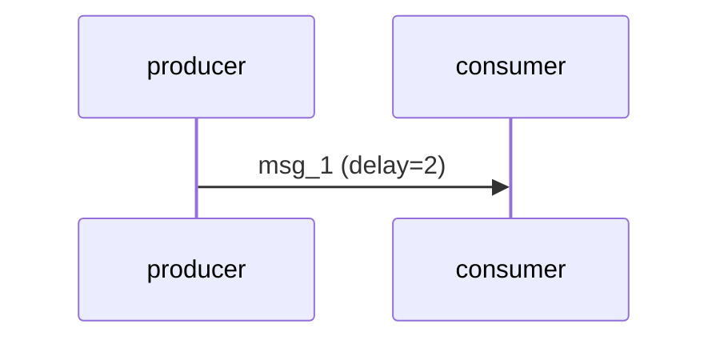

# PROPER ARCHITECTURE: kripke Package Methods

## Critical Issue Fixed

### ❌ WRONG: Previous Examples
```go
// example10_stateful_actors.go
func generateStatefulDiagram(g *kripke.Graph) string {
    var sb strings.Builder
    sb.WriteString("stateDiagram-v2\n")
    // ... duplicate diagram generation code in EVERY example
    return sb.String()
}
```

**Problems**:
1. Diagram generation code duplicated in every example
2. Standalone examples without imports are toys
3. No reusable library methods

### ✅ CORRECT: kripke Package Methods

**File**: `kripke/diagrams.go` (NEW)

```go
package kripke

// GenerateStateDiagram generates Mermaid state diagram
func (g *Graph) GenerateStateDiagram(options ...DiagramOption) string {
    // Implementation in package
}

// GenerateSequenceDiagram generates Mermaid sequence diagram
func (w *World) GenerateSequenceDiagram(maxEvents int) string {
    // Implementation in package
}

// GenerateCTLTable generates markdown CTL verification table
func (g *Graph) GenerateCTLTable(requirements []Requirement) string {
    // Implementation in package
}

// GenerateRequirementsTable generates markdown requirements table
func GenerateRequirementsTable(requirements []Requirement) string {
    // Implementation in package
}
```

**Examples use package methods**:
```go
package main

import "github.com/rfielding/kripke-ctl/kripke"

func main() {
    g := buildGraph()
    w := runSystem()
    
    // Use package methods - NO duplication!
    stateDiagram := g.GenerateStateDiagram()
    seqDiagram := w.GenerateSequenceDiagram(10)
    ctlTable := g.GenerateCTLTable(requirements)
}
```

---

## Package Structure

```
kripke-ctl/
├── kripke/
│   ├── ctl.go              (existing - CTL model checking)
│   ├── engine.go           (existing - Actor engine)
│   ├── diagrams.go         (NEW - Mermaid generation) ⭐
│   └── types.go            (NEW - Requirement type)
└── examples/
    ├── example1.go         (uses kripke.GenerateStateDiagram)
    ├── example2.go         (uses kripke.GenerateSequenceDiagram)
    └── example3.go         (uses kripke.GenerateCTLTable)
```

---

## New File: kripke/diagrams.go

### Methods Added

#### 1. Graph.GenerateStateDiagram()
```go
func (g *Graph) GenerateStateDiagram(options ...DiagramOption) string
```

**Purpose**: Generate Mermaid state diagram from graph  
**Options**:
- `WithStateDescriber(func)` - Custom state descriptions
- `WithEdgeLabeler(func)` - Custom edge labels (guards, actions)
- `WithoutActions()` - Hide actions on edges
- `WithoutGuards()` - Hide guards on edges

**Example**:
```go
diagram := g.GenerateStateDiagram(
    kripke.WithStateDescriber(func(sid StateID, g *Graph) string {
        return fmt.Sprintf("buffer_size=%d", extractSize(sid))
    }),
    kripke.WithEdgeLabeler(func(from, to StateID, g *Graph) string {
        return "[guard] action: variables++"
    }),
)
```

**Output**:


```mermaid
stateDiagram-v2
    [*] --> buffer_0
    buffer_0 --> buffer_1: [buffer_size < 2] produce: send(msg); itemsProduced++
    buffer_0: buffer_size=0
```

#### 2. World.GenerateSequenceDiagram()
```go
func (w *World) GenerateSequenceDiagram(maxEvents int) string
```

**Purpose**: Generate Mermaid sequence diagram from execution trace  
**Parameters**:
- `maxEvents` - Max events to show (0 = all)

**Example**:
```go
w := kripke.NewWorld(actors, channels, seed)
// ... run system ...
diagram := w.GenerateSequenceDiagram(10) // First 10 events
```

**Output**:


#### 3. Graph.GenerateCTLTable()
```go
func (g *Graph) GenerateCTLTable(requirements []Requirement) string
```

**Purpose**: Generate markdown table of CTL verification results  
**Example**:
```go
requirements := []kripke.Requirement{
    {
        ID: "REQ-SAF-01",
        Description: "Buffer never overflows",
        FormulaString: "AG(¬buffer_full)",
        Formula: kripke.AG(kripke.Not(kripke.Atom("buffer_full"))),
    },
}

table := g.GenerateCTLTable(requirements)
```

**Output**:
```markdown
| ID | Requirement | CTL Formula | Result |
|----|-------------|-------------|--------|
| REQ-SAF-01 | Buffer never overflows | `AG(¬buffer_full)` | ✅ PASS |
```

#### 4. GenerateRequirementsTable()
```go
func GenerateRequirementsTable(requirements []Requirement) string
```

**Purpose**: Generate markdown table of requirements with traceability  
**Example**:
```go
table := kripke.GenerateRequirementsTable(requirements)
```

**Output**:
```markdown
| ID | Category | Requirement | CTL Formula | Traces to |
|----|----------|-------------|-------------|-----------|
| REQ-SAF-01 | Safety | Buffer never overflows | `AG(¬full)` | English Req #2 |
```

---

## New Type: Requirement

```go
type Requirement struct {
    ID            string    // REQ-SAF-01
    Category      string    // Safety, Liveness, etc.
    Description   string    // Human-readable requirement
    FormulaString string    // CTL formula as string
    Formula       Formula   // Actual CTL formula for checking
    EnglishRef    string    // Reference to original English requirement
    Rationale     string    // Why this requirement exists
}
```

---

## Proper Example Structure

```go
package main

import (
    "fmt"
    "os"
    "strings"
    
    "github.com/rfielding/kripke-ctl/kripke"  // MUST import!
)

type MyActor struct {
    id string
    x  int  // State variable
}

func (a *MyActor) ID() string { return a.id }

func (a *MyActor) Ready(w *kripke.World) []kripke.Step {
    // Guard
    if a.x >= 10 {
        return nil
    }
    
    // Action
    return []kripke.Step{
        func(w *kripke.World) {
            a.x++  // x' = x + 1
        },
    }
}

func main() {
    // 1. Build actors and world
    actor := &MyActor{id: "actor", x: 0}
    w := kripke.NewWorld([]kripke.Process{actor}, nil, 42)
    
    // 2. Run system
    for i := 0; i < 10; i++ {
        w.StepRandom()
    }
    
    // 3. Build graph
    g := buildGraph()
    
    // 4. Generate diagrams using PACKAGE METHODS
    var md strings.Builder
    
    md.WriteString("## Sequence Diagram\n\n```mermaid\n")
    md.WriteString(w.GenerateSequenceDiagram(10))  // Package method!
    md.WriteString("```\n\n")
    
    md.WriteString("## State Machine\n\n```mermaid\n")
    md.WriteString(g.GenerateStateDiagram())  // Package method!
    md.WriteString("```\n\n")
    
    // 5. Verify CTL
    requirements := []kripke.Requirement{
        {
            ID: "REQ-1",
            Description: "x never exceeds 10",
            FormulaString: "AG(x ≤ 10)",
            Formula: kripke.AG(kripke.Atom("x_valid")),
        },
    }
    
    md.WriteString("## Verification\n\n")
    md.WriteString(g.GenerateCTLTable(requirements))  // Package method!
    
    // 6. Write file
    os.WriteFile("output.md", []byte(md.String()), 0644)
}

func buildGraph() *kripke.Graph {
    g := kripke.NewGraph()
    // Build state space
    return g
}
```

---

## Files to Add to kripke-ctl Repository

### 1. kripke/diagrams.go (NEW)
Contains all diagram generation methods:
- `Graph.GenerateStateDiagram()`
- `World.GenerateSequenceDiagram()`
- `Graph.GenerateCTLTable()`
- `GenerateRequirementsTable()`

### 2. kripke/types.go (NEW)
Contains types for requirements:
- `Requirement` struct
- `DiagramOption` function type
- Helper types

### 3. Updated examples/
All examples should:
- Import `github.com/rfielding/kripke-ctl/kripke`
- Use package methods for diagram generation
- NOT duplicate diagram code

---

## Migration Guide

### For Existing Examples

❌ **Before** (duplicated code):
```go
func generateStateDiagram(g *kripke.Graph) string {
    var sb strings.Builder
    sb.WriteString("stateDiagram-v2\n")
    // ... 50 lines of diagram generation ...
    return sb.String()
}

func main() {
    g := buildGraph()
    diagram := generateStateDiagram(g)  // Local function
}
```

✅ **After** (use package method):
```go
import "github.com/rfielding/kripke-ctl/kripke"

func main() {
    g := buildGraph()
    diagram := g.GenerateStateDiagram()  // Package method!
}
```

---

## Benefits

### 1. No Code Duplication
- Diagram generation logic in ONE place (kripke/diagrams.go)
- Examples just call package methods
- Bug fixes apply to all examples

### 2. Customization
- Options pattern for flexibility
- Custom describers and labelers
- Easy to extend

### 3. Proper Architecture
- Library provides functionality
- Examples demonstrate usage
- Clear separation of concerns

### 4. Maintenance
- Update diagrams? Change kripke/diagrams.go
- Examples automatically get improvements
- No need to update 10+ examples

---

## Example Usage Patterns

### Pattern 1: Basic State Diagram
```go
diagram := g.GenerateStateDiagram()
```

### Pattern 2: State Diagram with Actions
```go
diagram := g.GenerateStateDiagram(
    kripke.WithEdgeLabeler(func(from, to StateID, g *Graph) string {
        return "[guard] action: var++"
    }),
)
```

### Pattern 3: Sequence Diagram (Limited)
```go
diagram := w.GenerateSequenceDiagram(10)  // First 10 events
```

### Pattern 4: CTL Verification Table
```go
table := g.GenerateCTLTable(requirements)
```

### Pattern 5: Full Report
```go
var md strings.Builder
md.WriteString(kripke.GenerateRequirementsTable(reqs))
md.WriteString("```mermaid\n" + g.GenerateStateDiagram() + "```\n")
md.WriteString("```mermaid\n" + w.GenerateSequenceDiagram(10) + "```\n")
md.WriteString(g.GenerateCTLTable(reqs))
```

---

## Summary

### What Was Wrong
1. Examples duplicated diagram generation code
2. Standalone examples without imports are toys
3. No reusable library methods

### What's Now Correct
1. ✅ Diagram generation in `kripke/diagrams.go`
2. ✅ Examples import package and use methods
3. ✅ Customizable via options pattern
4. ✅ All examples use same tested code

### Files to Add to kripke-ctl
- `kripke/diagrams.go` - All diagram generation methods
- `kripke/types.go` - Requirement and option types
- Update all examples to use package methods

**No more duplicated diagram code in examples!**
