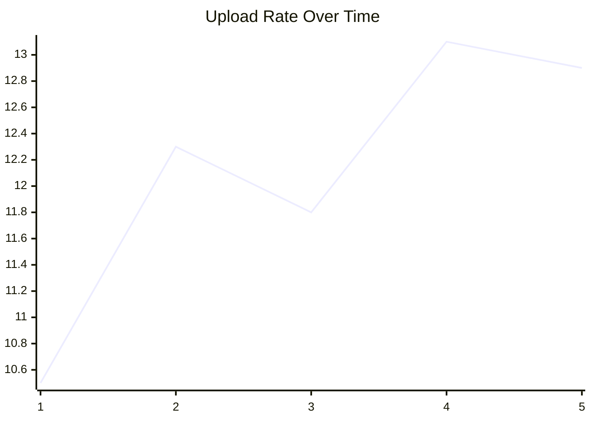
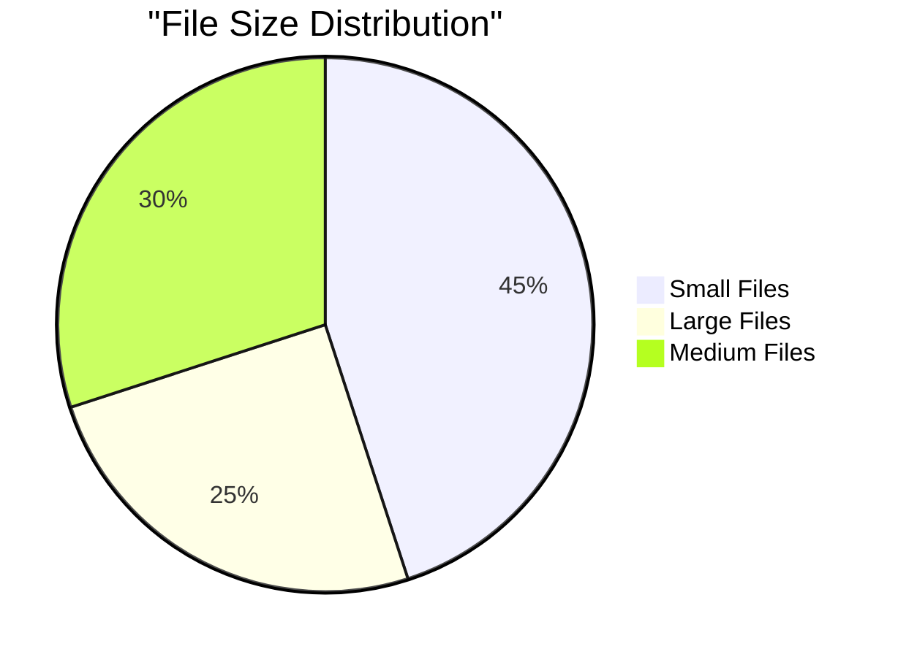

# Why Chance Nodes: From Markov Chains to MDP

## The Problem with Communicating Markov Chains

### Attempt: Communicating Markov Chains
```
Goal: Have actors that communicate via message passing,
      where state transitions are probabilistic.

Problem: In a pure Markov Chain, the ONLY way to change states
         is through random/probabilistic transitions.

Markov Chain:
  State s --[probability p]--> State s'
  
  NO control over which transition happens
  NO way to condition on message passing
  NO way to have guards/predicates
```

### Why It Doesn't Work

**Markov Chain constraints**:
- State changes are ONLY probabilistic
- No conditional logic
- No message passing semantics
- No guards based on variables

**What we need for actors**:
- State changes via: variable edits, sends, recvs
- Conditional transitions (guards)
- Message passing that affects state
- Deterministic actions with probabilistic choices

### The Solution: Add Chance Nodes → Get MDP

```
MDP = Markov Decision Process

Key addition: ACTIONS that are chosen, THEN probability

Structure:
  State s --[action a, chosen]--> Chance Node --[probability]--> State s'
  
  1. State determines possible actions (guards)
  2. Scheduler CHOOSES action (nondeterministic)
  3. Chance node picks outcome (probabilistic)
  4. Transition to next state
```

### MDP with Message Passing

```
Actor A in state s:
  1. Guards check: Can I send? Is x > 0? Channel not full?
  2. If yes: Action = send message, edit x
  3. Scheduler chooses this action
  4. Chance node may pick variant:
     - 50% send 1 message, x' = x + 1
     - 50% send 2 messages, x' = x + 2
  5. Messages delivered → affect other actors' states
```

## Why This Works

### Communicating MDP Features

1. **States** = Actor variables (`{x: 5, sent: 10, buffer: [msg1, msg2]}`)

2. **Guards** = Predicates over variables (`x > 0`, `buffer not full`)

3. **Actions** = Three types:
   - Variable edit: `x' = x + 1`
   - Send message: `ch!msg`
   - Recv message: `ch?msg`

4. **Chance nodes** = Probabilistic outcomes within an action:
   ```go
   if rand() < 0.6 {
       send(1 message)  // Outcome 1
   } else {
       send(2 messages) // Outcome 2
   }
   ```

5. **Scheduler** = Nondeterministic choice among enabled actions

6. **Communication** = Messages change receiver's state

### Example: Producer with Chance Node

```go
func (p *Producer) Ready(w *World) []Step {
    // Guard: can send
    if !ch.CanSend() {
        return nil
    }
    
    // Guard: not done
    if p.sent >= MAX {
        return nil
    }
    
    // Action with chance node
    return []Step{
        func(w *World) {
            // Chance node picks outcome:
            if rand() < 0.6 {
                // Outcome 1 (60%): send 1
                SendMessage(w, msg)
                p.sent++
            } else {
                // Outcome 2 (40%): send 2
                SendMessage(w, msg1)
                SendMessage(w, msg2)
                p.sent += 2
            }
        },
    }
}
```

## Messages as Counters

### Line Charts (Time Series)

Messages can carry counter data for line charts:

```go
type MetricMessage struct {
    Timestamp int
    Value     float64
    Metric    string
}

// Send metric update
SendMessage(w, Message{
    Payload: MetricMessage{
        Timestamp: w.CurrentStep,
        Value:     throughput,
        Metric:    "upload_rate",
    },
})

// Collector receives and builds time series:
// [(1, 10.5), (2, 12.3), (3, 11.8), ...]
// → Line chart of upload_rate over time
```

**Generated chart**:


### Pie Charts (Categories)

Messages can carry categorical data for pie charts:

```go
type CategoryMessage struct {
    Category string
    Count    int
}

// Send category counts
SendMessage(w, Message{
    Payload: CategoryMessage{
        Category: "small_files",
        Count:    45,
    },
})

SendMessage(w, Message{
    Payload: CategoryMessage{
        Category: "large_files",
        Count:    25,
    },
})

// Collector receives and builds distribution:
// {"small_files": 45, "large_files": 25, "medium_files": 30}
// → Pie chart of file size distribution
```

**Generated chart**:


## Blocking Semantics (Go Channels)

### Key Point: Only Blocked If TRYING

You are **ONLY** blocked on send if you are **TRYING** to send AND the channel is full.

```go
func (p *Producer) Ready(w *World) []Step {
    // Actor decides: do I want to send?
    if p.mode == IDLE {
        // NOT trying to send → NOT blocked
        return nil
    }
    
    // Now trying to send - check if blocked
    ch := w.ChannelByAddress(target)
    if ch == nil || !ch.CanSend() {
        // TRYING to send but blocked → return nil
        return nil
    }
    
    // Not blocked, can send
    return []Step{...}
}
```

### Go Channel Semantics (Buffered)

For channels with `length > 0` (buffered):

**Send blocks if**:
```go
len(channel) >= cap(channel)  // Channel full
```

**Recv blocks if**:
```go
len(channel) == 0  // Channel empty
```

**Example**:
```go
ch := make(chan Message, 3)  // Capacity 3

// Send doesn't block until full
ch <- msg1  // OK (len=1)
ch <- msg2  // OK (len=2)
ch <- msg3  // OK (len=3)
ch <- msg4  // BLOCKS (len=3=cap)

// Recv doesn't block until empty
<-ch  // OK (len=2)
<-ch  // OK (len=1)
<-ch  // OK (len=0)
<-ch  // BLOCKS (len=0)
```

### In kripke Library

```go
// Channel methods
func (ch *Channel) CanSend() bool {
    return len(ch.queue) < ch.capacity
}

func (ch *Channel) CanRecv() bool {
    return len(ch.queue) > 0
}

// Actor checks BEFORE trying
func (a *Actor) Ready(w *World) []Step {
    // Only check if TRYING to send
    if a.wantsToSend {
        ch := w.ChannelByAddress(target)
        if !ch.CanSend() {
            return nil  // Blocked
        }
    }
    
    // Only check if TRYING to recv
    if a.wantsToRecv {
        if !a.inbox.CanRecv() {
            return nil  // Blocked
        }
    }
    
    return []Step{...}
}
```

## Summary

### Why Chance Nodes Exist

1. **Tried**: Communicating Markov Chains
2. **Problem**: Only random state changes, no control
3. **Solution**: Add chance nodes → MDP
4. **Result**: Actions chosen, then probability within action

### MDP Structure

```
State (actor variables)
  ↓
Guards (predicates) → Determine possible actions
  ↓
Scheduler (nondeterministic) → Choose action
  ↓
Chance node (probabilistic) → Choose outcome
  ↓
Actions (variable edits, send, recv)
  ↓
New state
```

### Messages as Data

- **Counters for line charts**: Time series data
- **Counters for pie charts**: Categorical distribution
- **Communication**: Affect other actors' states

### Blocking Rules

- **Send**: Only blocked if TRYING to send AND channel full
- **Recv**: Blocked if reading from empty channel
- **Go semantics**: Buffered channels (length > 0)

---

**This is why we have communicating MDPs with chance nodes, not communicating Markov Chains!**
