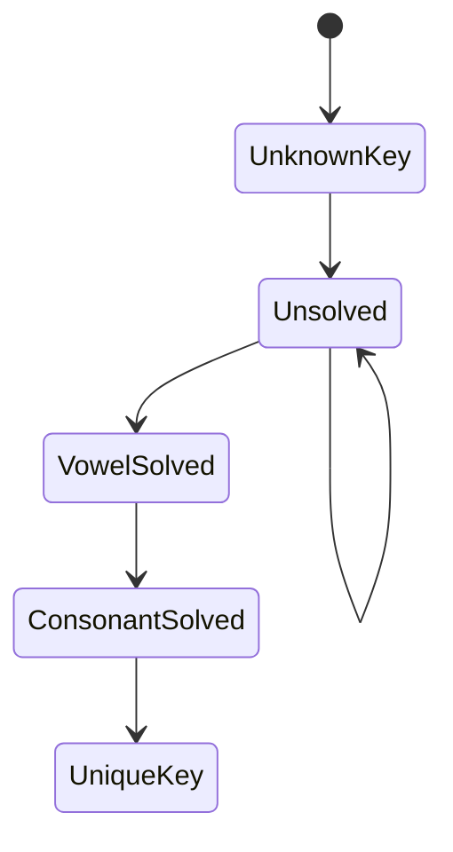

# Model: purple

## Original English Requirement

Scenario: Japanese PURPLE diplomatic cipher keyspace collapse.

We model the attacker's progress in shrinking the key hypothesis space
as more traffic is observed. Because the cipher splits the alphabet
into independent vowel and consonant channels, the effective keyspace
collapses much faster than for a well-designed rotor machine.

## Generated Model

The Go model for this scenario lives in `kripke/purple_model.go` and
`models/purple/model.go`. It is intentionally tiny: we only track the
coarse stages of the attack:

- `UnknownKey` – initial uncertainty
- `Unsolved` – traffic is observed but analysis is incomplete
- `VowelSolved` – the 6-letter channel is cracked
- `ConsonantSolved` – the 20-letter channel is cracked
- `UniqueKey` – only one key remains consistent with the traffic

## CTL Properties

Some CTL properties we care about (informally):

- **AF attackerKnowsKey** – along every path, eventually the attacker
  learns the unique key.
- **AG !attackerKnowsKey** – along every path, the attacker never
  learns the key (desirable but false for PURPLE).
- **EF UniqueKey** – it is possible to reach a state where the key is
  fully determined.

These are not yet wired into an executable CTL model of PURPLE, but
the CTL engine in `kripke/ctl.go` is ready to host them.

## Diagrams

