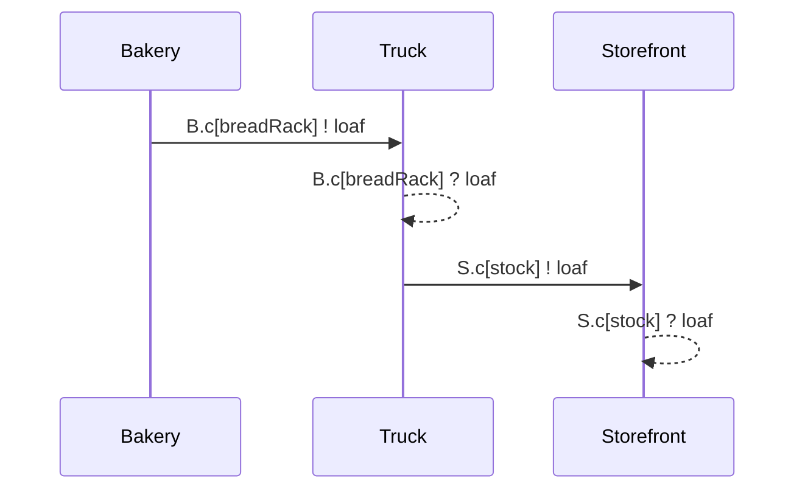
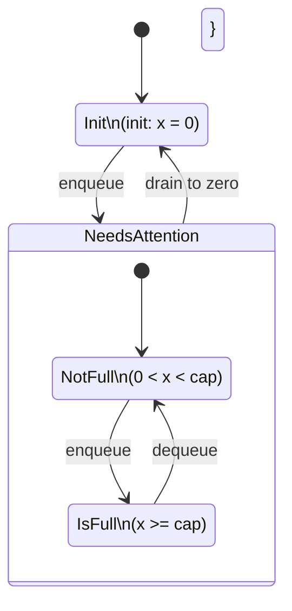

A complete, persistent summary of system semantics, data structures, invariants, modeling rules, scheduler behavior, CTL concepts, and diagramming conventions.

Purpose:
This file ensures the entire project can be reconstructed even if chat history is lost.
ChatGPT or any LLM can read this file as authoritative system context and rebuild the project deterministically.

1. Core Model Overview

The system is a communicating Markov Decision Process engine implemented in Go, with:

Actors: independent processes with local state and a Ready(*World) method.

Channels: owned by actors; each is a FIFO mailbox or rendezvous point.

Scheduler: collects all enabled steps from all actors, then randomly executes exactly one.

Events: everything is logged into a single ordered event log (MsgEnvelope) for:

metrics

diagrams

replay

CTL reasoning

The system builds a Kripke structure from execution, enabling CTL model checking (EF, EG, AF, AG, EX, AX, EU).

2. Actor Semantics

Each actor is a Go struct implementing:

```go	
type Process interface {
    ID() string
    Ready(w *World) []Step  // determines enabled transitions
}
```

Actor State Rules

Actors have local state variables.

Actors may own inbound channels, each acting like an independent partition.

Actors may send messages into channels owned by other actors.

Actors may only read from their own channels.

3. Channel Semantics

A Channel is:

```go
type Channel[T any] struct {
    buf []T
    cap int // 0 = rendezvous, >0 = buffered
}
```

Buffered Channels (cap > 0)

CanSend = len(buf) < cap

CanRead = len(buf) > 0

Send appends item and returns true.

Read removes oldest item and returns true.

Excess sends block by omission: step not added to Ready.

Rendezvous Channels (cap = 0)

No buffer.

A send is only enabled if a matching recv is also proposed in the same scheduler tick.

A recv is only enabled if a send is proposed.

The scheduler pairs send & recv into a single rendezvous step.

4. Guard Predicates (State Names)

Each actor may define named predicates describing logical modes:

Example:

init: x == 0

needsAttention: x > 0

isFull: x >= cap

These serve multiple roles:

Step guards (enabling/disabling transitions)

Diagram labels (FSM states)

CTL atomic propositions

Predicates may nest logically:

isFull ⇒ needsAttention

Which is represented in FSM diagrams via nested states.

5. Step Semantics

A step is a function:

type Step func(*World)


Steps may:

mutate actor-local variables

mutate channel state (send/receive)

emit events

move actor to a different logical predicate state

trigger chance nodes (probabilistic branching)

One step = one atomic transition in the Kripke graph.

Steps implement the designer’s logic, including:

```go
x = x + 1        // local mutation
c.TrySend(msg)   // send message
msg, _ = c.TryRead()   // receive message
```

This corresponds to the TLA-style:

```tla
x' = x + 1
```

but localized to actors rather than global relational steps.

6. The READY Rule

An actor contributes a step to the scheduler’s enabled set if and only if:

Its predicate guards are true
(init, needsAttention, etc.)

Channel operations are feasible

CanSend for sends

CanRead for receives

matching sends/receives for rendezvous channels

The Ready(w) method MUST enforce:

predicate guards

channel feasibility

If a step violates guards or channel rules, it MUST NOT be included.

This is how we encode DBC (Design by Contract):

guards = preconditions

Ready = precondition filter

7. Scheduler Semantics (Critical)

The scheduler implements the global nondeterministic choice.

Algorithm:
1. Collect all enabled steps from all actors.
2. Remove steps that require impossible channel conditions.
3. For cap=0 channels, pair compatible send/recv steps.
4. If enabled set empty: quiescent or deadlock.
5. Choose ONE enabled step uniformly at random.
6. Execute it.
7. Increment logical time.
8. Log all events to EventLog.


This ensures:

fairness

nondeterminism

reproducibility via seed

correct semantics for parallel actors

8. Global Event Log

All message deliveries and all internal steps are logged in order:

```go
type MsgEnvelope struct {
    Time      int
    From      string
    FromChan  string
    To        string
    ToChan    string
    Payload   any
    ReplyTo   *Address
    Partition int // optional sharding key
}
```


The log is append-only and forms:

the basis of sequence diagrams

event sourcing

performance metrics (throughput, latency, backlog)

CTL temporal evaluation (building the Kripke graph)

9. Partitioning (Kafka Analogy)

Each (ActorID, ChannelName) pair behaves like a Kafka partition:

ordering is preserved within that channel

reordering permitted across different channels of the same actor

Optionally, a Sharder may compute a partition ID:

```go
type Sharder interface {
    PartitionFor(msg MsgEnvelope) int
}
```


Used to enforce domain-specific ordering (e.g. group events by OrderID).

10. CTL Semantics

The system supports standard Computational Tree Logic:

```
EF φ — φ is possible eventually

AF φ — φ happens on all paths eventually

EG φ — φ is possible and holds globally

AG φ — φ holds globally on all paths

EX φ — φ holds in some successor state

AX φ — φ holds in all successor states

E[f U g] — on some path, f holds until g
```

CTL Evaluator Interface:

```go
func (g *Graph) EG(p Atom) StateSet
func (g *Graph) EF(p Atom) StateSet
func (g *Graph) AF(p Atom) StateSet
func (g *Graph) AG(p Atom) StateSet
func (g *Graph) EX(p Atom) StateSet
func (g *Graph) AX(p Atom) StateSet
func (g *Graph) EU(p, q Atom) StateSet
```

Graph nodes correspond to discrete world states after each step.

Atoms refer to:

predicate labels (e.g., Actor.isFull)

message conditions

structural invariants

11. Diagrams
11.1 Interaction Diagrams (Message Sequence)

Generated from EventLog:



Events map directly to arrows.

11.2 FSM Diagrams (Predicate-Based)

Predicates define state labels:




These diagrams reflect guard semantics and nested predicates.

12. Summary of Invariants

Actors do not share state.
Communication only happens through channels.

Channels are owned by the receiver.
Senders may write; only owner may read.

Scheduler picks exactly one enabled transition globally per step.

Each transition is atomic and logged.

State predicates define control modes and CTL atoms.

Rendezvous channels require paired steps.

EventLog is strictly ordered by receive time.

CTL queries operate on the Kripke structure built from logged states.

13. Recovery Instructions

If a conversation is lost:

Open a fresh ChatGPT session.

Paste this file into the system prompt or say:

“Use docs/project_state.md as system context.”

Then ask:

“Reconstruct the latest version of the engine, scheduler, CTL evaluator, and actor templates.”

The model will correctly reproduce:

the engine

channels

scheduler semantics

CTL evaluator

diagrams

modeling language

This document is sufficient to rebuild everything from scratch.

End of docs/project_state.md

If you want, I can also generate:

docs/system_prompt.md

A template scenario test suite

Mermaid generators (Go code)

A CTL example battery

Actor templates for Bakery/Truck/Storefront system

Just say “give me system_prompt.md”.

You said:
