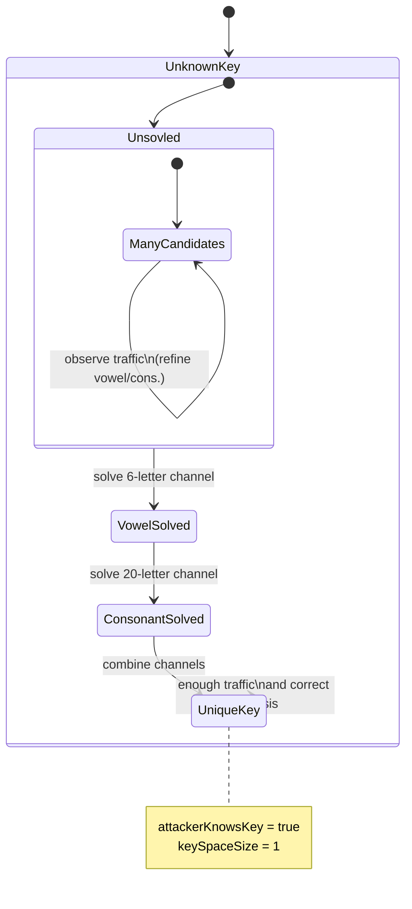

Diagrams
===============

```mermaid
stateDiagram-v2
  [*] --> UnknownKey

  state UnknownKey {
    [*] --> Unsovled
    Unsovled --> VowelSolved : solve 6-letter channel
    VowelSolved --> ConsonantSolved : solve 20-letter channel
    ConsonantSolved --> UniqueKey : combine channels
  }

  state Unsovled {
    [*] --> ManyCandidates
    ManyCandidates --> ManyCandidates : observe traffic\n(refine vowel/cons.)
  }

  state UniqueKey <<terminal>>

  UnknownKey --> UniqueKey : enough traffic\nand correct analysis

  note right of UniqueKey
    attackerKnowsKey = true
    keySpaceSize = 1
  end note
```
