Scheduler rules
=============

interaction of communicating actors in bakery scenario

flowchard of steps in scheduler

FSM
====================

The state machines and interactions are related because reads and writes happen based on states we are in. Roughly each state is a machine instruction for a single varible change, send, recv, or write.

```mermaid
stateDiagram-v2
    [*] --> Init

    state "Init\n(init: x = 0)" as Init

    state NeedsAttention {
        [*] --> NotFull

        state "NotFull\n(needsAttention: x > 0 ∧ x < cap)" as NotFull
        state "IsFull\n(isFull: x >= cap)" as IsFull

        NotFull --> IsFull: enqueue\nx' = x + 1
        IsFull --> NotFull: dequeue\nx' = x - 1
    }

    Init --> NeedsAttention: first enqueue\nx' = x + 1
    NeedsAttention --> Init: drain to zero\nx' = 0
```

