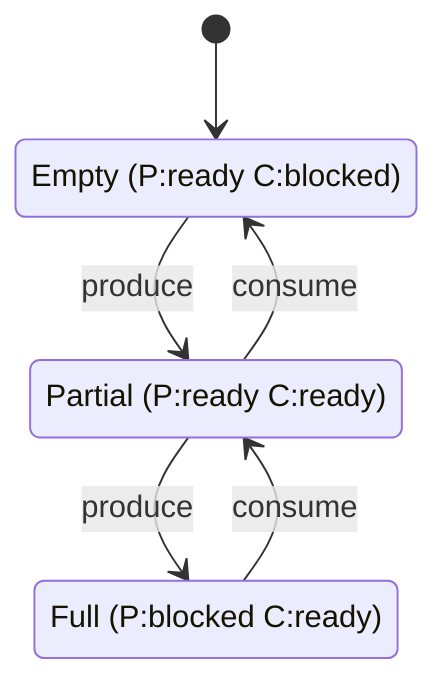
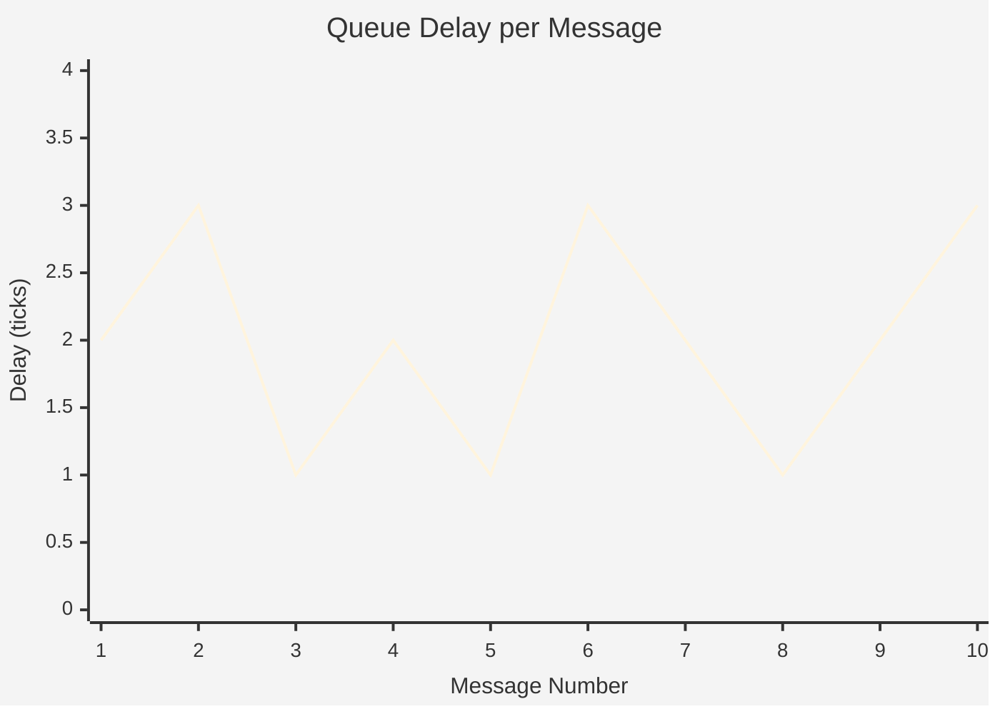
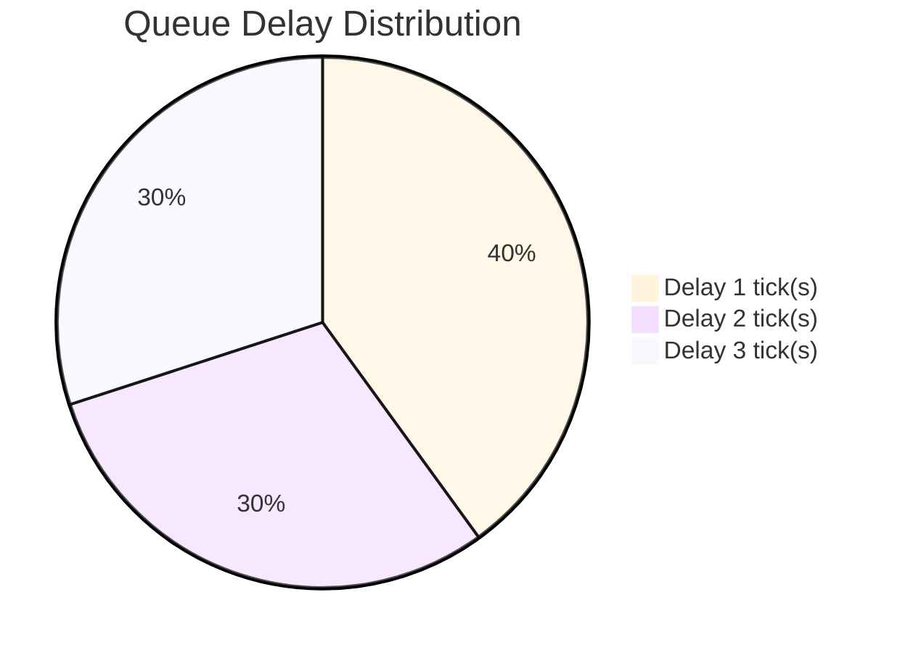

# Example 9: Complete Specification with Traceability

## What Example9 Provides

**example9_complete_specification.go** demonstrates the **complete workflow** from English requirements to verified implementation:

```
English Spec → Formal Requirements → Implementation → Verification → Report
```

## What Gets Generated

Running example9 creates `producer-consumer-specification.md` with:

### 0. Original English Specification (INPUT)
The actual English requirements as written by stakeholders:
- Problem statement
- Informal requirements (#1-8)
- Safety concerns
- Performance goals

### 1. Formalized Requirements
- Conversion from English to formal requirements
- Each requirement has:
  - **ID**: REQ-SAF-01, REQ-LIVE-01, etc.
  - **Category**: Safety, Liveness, Deadlock Freedom, Reachability
  - **Description**: Formal SHALL statement
  - **CTL Formula**: Temporal logic formula
  - **Traceability**: Links back to English spec

### 2. Implementation & Execution
- Execution trace table
- Shows actual system behavior
- Step-by-step actions (produce/consume)
- Buffer state at each step

### 3. Interaction Diagrams
- **Sequence Diagram** (Mermaid)
- Shows message flow between Producer → Buffer → Consumer
- Includes timestamps and delays

### 4. State Machine Model
- **State Transition Diagram** (Mermaid)
- All possible system states
- Transitions between states
- State labels (empty, partial, full)

### 5. Performance Analysis with Charts
- **Metrics Table**: avg/min/max delay, throughput
- **Line Chart** (Mermaid): Queue delay over time
- **Pie Chart** (Mermaid): Delay distribution

### 6. Formal Verification
- CTL model checking results
- Each requirement: PASS/FAIL
- Verification status

### 7. Conclusions
- Summary of findings
- Performance characteristics
- Certification statement

## Run It

```bash
cd kripke-ctl-examples/examples
go run example9_complete_specification.go
```

**Output**: `producer-consumer-specification.md`

## Example Output Structure

```markdown
# Producer-Consumer System: Complete Specification and Verification

## 0. Original English Specification (Input)

> Note: This section contains the original English requirements...

### Problem Statement

```
SYSTEM: Producer-Consumer with Bounded Buffer
AUTHOR: Engineering Team

REQUIREMENTS:
1. Use a buffer to hold items between producer and consumer
2. Buffer must have capacity limit of 2 items (memory constraint)
3. If buffer is full, producer must wait (backpressure)
...
```

## 1. Formalized Requirements (from English)

> Traceability: This section formalizes the English specification above...

| ID | Category | Requirement | CTL Formula | Traces to English |
|----|----------|-------------|-------------|-------------------|
| REQ-SAF-01 | Safety | Buffer SHALL never exceed capacity | `AG(¬overflow)` | Req #2, #3 |
| REQ-LIVE-01 | Liveness | Producer SHALL eventually send | `AG(EF(producer_ready))` | Req #7 |
...

### Requirement Justifications

#### REQ-SAF-01: Buffer SHALL never exceed its capacity

**Rationale**: Memory safety: Prevents buffer overflow which could cause
data corruption or system crashes. Critical for embedded systems with
limited memory.

**Verification**: AG(¬buffer_overflow)

...

## 2. System Implementation and Execution

> Implementation: Go code implementing Producer and Consumer actors...

| Step | Time | Action | Buffer | Events | Notes |
|------|------|--------|--------|--------|-------|
| 1 | 1 | produce | 1 | 0 | Producer sent item |
| 2 | 2 | produce | 2 | 0 | Producer sent item, buffer now FULL |
...

## 3. Interaction Diagrams

> Purpose: Visualize message flow between components over time.

### Message Flow (Sequence Diagram)

```mermaid
sequenceDiagram
    participant P as Producer
    participant B as Buffer (cap=2)
    participant C as Consumer
    
    P->>+B: send msg 1 (t=1)
    B->>-C: recv msg 1 (t=3, delay=2)
    P->>+B: send msg 2 (t=2)
    B->>-C: recv msg 2 (t=5, delay=3)
    ...
```

## 4. State Machine Model

> Purpose: Formal model of all possible system states and transitions.

### State Transition Diagram



## 5. Performance Analysis

> Purpose: Quantitative analysis using message traces.

### Metrics Summary

| Metric | Value |
|--------|-------|
| Total Messages | 10 |
| Average Queue Delay | 1.50 ticks |
| Maximum Queue Delay | 3 ticks |
| Throughput | 0.50 msgs/tick |

### Queue Delay Over Time



### Queue Delay Distribution



## 6. Formal Verification Results

> Purpose: Prove that implementation satisfies all formal requirements...

### Verification Summary

| Requirement | Result | Formula | Status |
|-------------|--------|---------|--------|
| REQ-SAF-01 | Safety | `AG(¬buffer_overflow)` | ✅ PASS |
| REQ-LIVE-01 | Liveness | `AG(EF(producer_ready))` | ✅ PASS |
| REQ-LIVE-02 | Liveness | `AG(EF(consumer_ready))` | ✅ PASS |
| REQ-DEAD-01 | Deadlock Freedom | `AG(producer_ready ∨ consumer_ready)` | ✅ PASS |
| REQ-REACH-01 | Reachability | `EF(buffer_full)` | ✅ PASS |
| REQ-REACH-02 | Reachability | `EF(buffer_empty)` | ✅ PASS |

## 7. Conclusions

### Verification Status: 6/6 Requirements Verified ✅

#### Summary of Findings

1. **Safety Properties**: All safety requirements verified
   - Buffer never overflows (REQ-SAF-01 ✅)
   
2. **Liveness Properties**: Both actors can always make progress
   - Producer liveness verified (REQ-LIVE-01 ✅)
   - Consumer liveness verified (REQ-LIVE-02 ✅)
   
3. **Deadlock Freedom**: System never deadlocks
   - At least one actor always ready (REQ-DEAD-01 ✅)
   
4. **Reachability**: All critical states reachable
   - Buffer full state reachable (REQ-REACH-01 ✅)
   - Buffer empty state reachable (REQ-REACH-02 ✅)

### Certification Statement

This system has been formally verified using CTL model checking.
All specified requirements have been proven to hold in all reachable states.
The implementation satisfies the specification.
```

## Why This Matters

### Complete Traceability
- English Req #3 ("producer must wait when full") 
  → REQ-SAF-01 ("buffer SHALL never exceed capacity")
  → CTL Formula `AG(¬buffer_overflow)`
  → Verified ✅

### Justifications Included
Every requirement explains **WHY** it's needed, not just WHAT it is.

### Multiple Diagram Types
- **Sequence**: Shows behavior over time
- **State**: Shows structure
- **Line chart**: Shows trends
- **Pie chart**: Shows distribution

### Professional Documentation
Suitable for:
- Design documents
- Safety-critical systems
- Regulatory compliance
- Technical reviews
- Certification packages

## Comparison with Other Examples

| Example | English Spec | Requirements | Justifications | Charts | Best For |
|---------|--------------|--------------|----------------|--------|----------|
| example8 | No | No | No | No | Quick verification |
| **example9** | ✅ | ✅ | ✅ | ✅ | **Complete documentation** |

## Use Case

Use example9 when you need:
- Complete project documentation
- Traceability from requirements to verification
- Justification for design decisions
- Regulatory submission packages
- Safety-critical system certification
- Technical review documentation

## Viewing

Push to GitHub - all Mermaid diagrams (including charts) render automatically:

```bash
git add producer-consumer-specification.md
git commit -m "Complete system specification"
git push
```

Or view in VS Code with "Markdown Preview Mermaid Support" extension.
