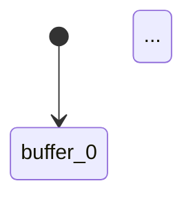

# kripke-ctl Examples Installation

## Quick Start

From your kripke-ctl repository root:

```bash
tar xzf kripke-ctl-examples.tar.gz
```

This will create an `examples/` directory with all example programs.

## Running the Examples

### Generate Markdown Reports (Recommended)

**Complete report with engine execution, diagrams, and CTL verification:**
```bash
cd examples
go run example6_complete_report.go
# Output: producer-consumer-complete-report.md
```

**Basic CTL verification report:**
```bash
go run example5_markdown_report.go
# Output: producer-consumer-report.md
```

### Print to Terminal

**Basic CTL verification:**
```bash
go run example3_with_import.go
```

**Engine integration:**
```bash
go run example4_engine_integration.go
```

### Self-Contained Examples (No Import)

These work anywhere without importing your package:
```bash
go run example1_client_server.go
go run example2_producer_consumer.go
```

## What Gets Generated

The Markdown-generating examples (5 & 6) create `.md` files with:
- System descriptions
- Embedded Mermaid diagrams (state diagrams, sequence diagrams)
- CTL verification results in tables
- Performance metrics
- Complete analysis

View them on GitHub/GitLab for automatic rendering, or use VS Code with Markdown preview.

## Example 6 Output Preview

```markdown
# Producer-Consumer: Complete Analysis Report

## 1. System Description
...

## 2. Engine Execution
| Step | Time | Action | Buffer Size | Events |
|------|------|--------|-------------|--------|
...

## 3. Event Log Analysis
Average queue delay: 1.23 ticks
```mermaid
sequenceDiagram
    participant P as Producer
    participant B as Buffer
    participant C as Consumer
    ...
```

## 4. State Space Model


## 5. CTL Property Verification
| Property | Formula | Result | Description |
|----------|---------|--------|-------------|
| Safety | `AG(¬overflow)` | ✅ | Buffer never overflows |
...

## 6. Conclusion
Verification Summary: 6/6 properties verified
...
```

## More Information

See `examples/README.md` for detailed descriptions of each example.
