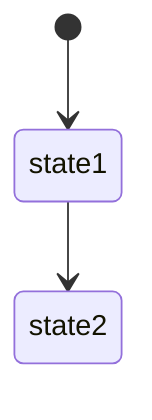
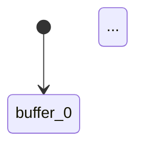

# Correct Mermaid Markdown Format

## The Problem

Mermaid diagrams won't render if the code fences aren't formatted correctly.

## ✅ Correct Format

The fences must be **exactly** like this:

```

```

Key points:
1. Opening fence: ` ```mermaid` followed by **newline**
2. Diagram code (no blank line after fence)
3. Closing fence: ` ``` ` on its **own line**
4. **No spaces** before closing fence
5. **Newline after** closing fence

## ❌ Common Mistakes

**Wrong - inline newline:**
```
```mermaid\n
```

**Wrong - no newline after opening:**
```
```mermaid stateDiagram-v2
```

**Wrong - spaces before closing:**
```
    ```
```

**Wrong - no newline after closing:**
```
``` text continues
```

## ⭐ Use example8 (Verified Clean)

I've created **example8_clean_markdown.go** with verified correct fences:

```bash
cd kripke-ctl-examples/examples
go run example8_clean_markdown.go
```

This generates: `producer-consumer-report.md`

**To verify it works:**

1. **GitHub Method** (easiest):
```bash
git add producer-consumer-report.md
git commit -m "Add CTL report"
git push
```
Open on GitHub - diagrams render automatically.

2. **VS Code Method**:
- Install extension: "Markdown Preview Mermaid Support"
- Open the .md file
- Press `Cmd+Shift+V` (Mac) or `Ctrl+Shift+V` (Windows/Linux)

3. **Mermaid Live Method**:
- Open https://mermaid.live
- Copy diagram code from .md file
- Paste to verify rendering

## Testing Your Fences

If diagrams don't render, check:

1. **Opening fence**:
```go
md.WriteString("```mermaid\n")  // ← Note the \n
```

2. **Diagram content**:
```go
md.WriteString("stateDiagram-v2\n")
md.WriteString("    [*] --> state1\n")
```

3. **Closing fence**:
```go
md.WriteString("```\n\n")  // ← Own line, double \n for spacing
```

## Example Code Snippet

Here's how to write Mermaid blocks in Go:

```go
var md strings.Builder

// State diagram with proper fences
md.WriteString("```mermaid\n")
md.WriteString("stateDiagram-v2\n")
md.WriteString("    [*] --> buffer_0\n")
md.WriteString("    buffer_0 --> buffer_1: produce\n")
md.WriteString("    buffer_1 --> buffer_0: consume\n")
md.WriteString("```\n\n")

// Sequence diagram with proper fences
md.WriteString("```mermaid\n")
md.WriteString("sequenceDiagram\n")
md.WriteString("    participant A\n")
md.WriteString("    participant B\n")
md.WriteString("    A->>B: message\n")
md.WriteString("```\n\n")
```

## Verification

After generating your .md file, check the raw text:

```bash
cat producer-consumer-report.md | grep -A 5 "```mermaid"
```

Should show:
```


**NOT**:
```
```mermaid\n  ← Wrong!
```
or
```
```mermaidstateDiagram-v2  ← Wrong!
```

## Quick Test

Run example8 and test on GitHub:

```bash
# Generate report
go run example8_clean_markdown.go

# Check the fences
head -50 producer-consumer-report.md

# If it looks good, push to GitHub
git add producer-consumer-report.md
git commit -m "CTL verification report"
git push

# Open on GitHub - diagrams should render
```

## All Working Examples

| Example | Output | Mermaid Rendering |
|---------|--------|-------------------|
| example8 ⭐ | Clean .md | ✅ Verified correct fences |
| example6 | .md with sequence diagram | ✅ Should work |
| example5 | .md with state diagram | ✅ Should work |

All examples in v3 tarball use proper fence formatting.
