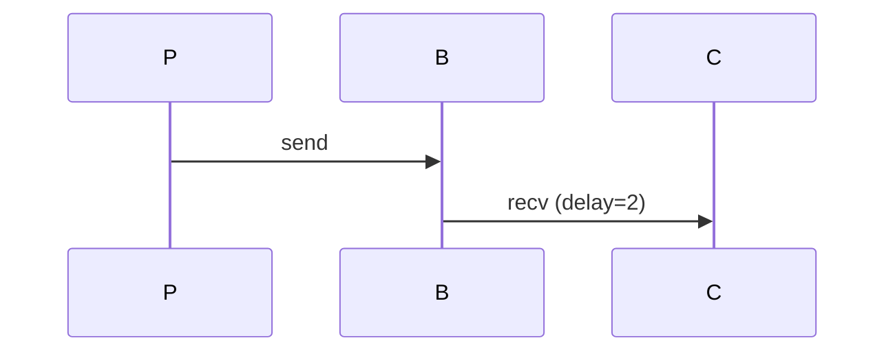
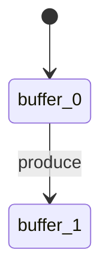

# Quick Start - Fixed Examples

All compilation errors fixed! ✅

## Extract and Run

```bash
# From your kripke-ctl root directory
cd ~/code/kripke-ctl
tar xzf kripke-ctl-examples-fixed.tar.gz

# Go to examples
cd kripke-ctl-examples/examples
```

## Best Example: Clean Markdown with Diagrams ⭐

```bash
go run example8_clean_markdown.go
```

**Output**: `producer-consumer-report.md`

**What you get**:
- Clean, readable Markdown
- Properly formatted Mermaid diagrams
- Engine execution trace
- Event log analysis with queue delays
- State space with Mermaid state diagram
- CTL verification results table
- Summary and metrics

**To view the diagrams**:
1. **GitHub** (easiest): Push the .md file, diagrams render automatically
2. **VS Code**: Install "Markdown Preview Mermaid Support", press Cmd+Shift+V
3. **Mermaid Live**: Copy diagram to https://mermaid.live

## All Working Examples

| Example | Import Package? | Output | Best For |
|---------|----------------|--------|----------|
| **example8** ⭐ | ✅ Yes | Clean .md | **Production use - complete report** |
| example6 | ✅ Yes | Detailed .md | More verbose report |
| example5 | ✅ Yes | Simple .md | Just CTL verification |
| example4 | ✅ Yes | Terminal | See engine + CTL integration |
| example3 | ✅ Yes | Terminal | Basic CTL demo |
| example1-2 | ❌ No | Terminal | Self-contained testing |

## Recommended Workflow

**For your own projects, use example8 as a template:**

```bash
# Copy example8 as starting point
cp example8_clean_markdown.go my_system.go

# Modify:
# 1. Change actors (Producer/Consumer)
# 2. Change state space extraction
# 3. Change CTL properties
# 4. Run it

go run my_system.go
```

## Example 8 Output Format

The Markdown file has:

```markdown
# Producer-Consumer CTL Verification

## System Description
- Prose description

## Engine Execution
| Step | Time | Action | Buffer | Events |
|------|------|--------|--------|--------|
| ... table of execution ... |

## Event Log
- Metrics (avg delay, max delay, messages)

### Event Timeline

```

## State Space
- List of states with labels

### State Diagram

```

## CTL Verification
| Property | Formula | Result | Description |
|----------|---------|--------|-------------|
| Safety | `AG(¬overflow)` | ✅ | Buffer never overflows |

## Summary
- Verification results
- Key findings
- Metrics
```

Clean, professional, and **the diagrams render on GitHub!**

## Compilation Fixed

The unused variable errors in examples 4, 6, 7, 8 are now fixed. All examples compile cleanly.

## Questions?

- **Diagrams not rendering?** See `MERMAID_FENCE_FORMAT.md`
- **Want HTML instead?** Use `example7_html_report.go`
- **Need more examples?** See `examples/README.md`

Start with **example8** - it's the cleanest!
