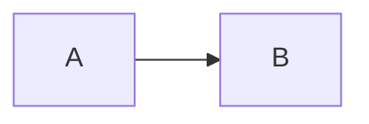

# How to View Mermaid Diagrams

## The Problem

When you run the Go programs that create `.md` files, the Mermaid code blocks **don't automatically render**. This is because:

1. Markdown files are plain text
2. Mermaid diagrams need JavaScript to render
3. Most text editors show the raw Mermaid code, not the rendered diagram

## Solution 1: Generate HTML Instead ⭐ (EASIEST)

Use **example7_html_report.go** which creates an HTML file with rendered diagrams:

```bash
cd kripke-ctl-examples/examples
go run example7_html_report.go
```

This creates `producer-consumer-report.html` that you can **open directly in your browser**:

```bash
open producer-consumer-report.html
# or on Linux: xdg-open producer-consumer-report.html
# or on Windows: start producer-consumer-report.html
# or just double-click the file
```

**The diagrams render immediately!** No setup needed.

## Solution 2: View Markdown on GitHub/GitLab

GitHub and GitLab automatically render Mermaid diagrams in `.md` files:

```bash
# After running example5 or example6
go run example6_complete_report.go

# Commit and push
git add producer-consumer-complete-report.md
git commit -m "Add CTL verification report"
git push
```

Open the file on GitHub - the diagrams will render automatically.

## Solution 3: VS Code with Extension

Install the "Markdown Preview Mermaid Support" extension:

1. Open VS Code
2. Install extension: `Markdown Preview Mermaid Support` by Matt Bierner
3. Open your `.md` file
4. Press `Cmd+Shift+V` (Mac) or `Ctrl+Shift+V` (Windows/Linux)

The diagrams will render in the preview.

## Solution 4: Online Mermaid Editor

Copy the Mermaid code from your `.md` file and paste into [Mermaid Live Editor](https://mermaid.live):

1. Run: `go run example6_complete_report.go`
2. Open `producer-consumer-complete-report.md`
3. Copy the Mermaid code (between ` ```mermaid` and ` ``` `)
4. Paste into https://mermaid.live
5. See the rendered diagram

## Solution 5: Install Markdown Viewer

### For macOS:
```bash
brew install --cask marked
```

### For Linux:
```bash
# Install grip (GitHub-flavored Markdown viewer)
pip install grip

# View your file
grip producer-consumer-complete-report.md
# Opens at http://localhost:6419
```

### For Windows:
Use VS Code (Solution 3) or generate HTML (Solution 1)

## Comparing Solutions

| Solution | Pros | Cons | Recommended? |
|----------|------|------|--------------|
| **HTML report** | ✅ Instant, no setup, beautiful | Need to generate HTML | ⭐⭐⭐⭐⭐ |
| GitHub/GitLab | ✅ Automatic rendering, shareable | Must push to repo | ⭐⭐⭐⭐ |
| VS Code | ✅ Local, good for editing | Need extension | ⭐⭐⭐ |
| Mermaid Live | ✅ No install | Manual copy/paste | ⭐⭐ |
| Markdown viewer | ✅ Local | Need to install | ⭐⭐ |

## Recommended Workflow

**Best approach:**

```bash
# Generate HTML report with rendered diagrams
cd kripke-ctl-examples/examples
go run example7_html_report.go

# Open in browser
open producer-consumer-report.html
```

**For sharing:**

```bash
# Generate Markdown
go run example6_complete_report.go

# Push to GitHub
git add producer-consumer-complete-report.md
git commit -m "CTL verification results"
git push
```

Then share the GitHub link - diagrams render automatically for everyone.

## Example Files

| Example | Output | How to View |
|---------|--------|-------------|
| example7 ⭐ | `.html` file | Open in browser (instant!) |
| example6 | `.md` file | Push to GitHub OR use VS Code |
| example5 | `.md` file | Push to GitHub OR use VS Code |

## Why This Happens

Mermaid diagrams are defined in text like this:

```

```

But they need JavaScript to convert that text into actual graphics. That's why:
- Plain text editors show the code
- HTML files with the Mermaid library render the graphics
- GitHub/GitLab have built-in Mermaid support

## Quick Test

Run this to see rendered diagrams immediately:

```bash
go run example7_html_report.go && open producer-consumer-report.html
```

The diagrams should appear in your browser!
