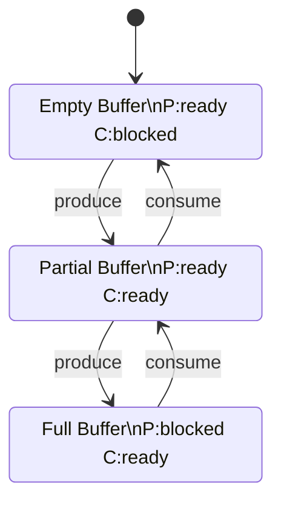
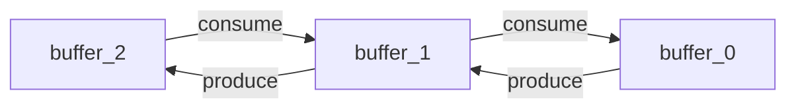

# Producer-Consumer CTL Verification Report

Generated by kripke-ctl

---

## System Description

A producer-consumer system with bounded buffer:

- Producer creates items and sends them to a buffer (capacity: 2)
- Consumer receives items from the buffer
- When buffer is full, producer must wait
- When buffer is empty, consumer must wait

## State Space

The system has **3 states**:

- **buffer_0**: empty, producer can send
- **buffer_1**: producer can send, consumer can receive
- **buffer_2**: full, consumer can receive

## State Diagram

## CTL Properties Verification

| Property | Result | Description | Formula |
|----------|--------|-------------|----------|
| Safety | ✅ PASS | Buffer never overflows | `AG(¬buffer_overflow) - In all reachable states, the buffer is never over capacity` |
| Liveness-Producer | ✅ PASS | Producer can always eventually send | `AG(EF(producer_ready)) - From any state, there exists a path where producer can send` |
| Liveness-Consumer | ✅ PASS | Consumer can always eventually receive | `AG(EF(consumer_ready)) - From any state, there exists a path where consumer can receive` |
| No-Deadlock | ✅ PASS | System never deadlocks | `AG(producer_ready ∨ consumer_ready) - In every state, at least one actor can make progress` |
| Reachability-Full | ✅ PASS | Buffer can become full | `EF(buffer_full) - There exists a path where the buffer reaches capacity` |
| Reachability-Empty | ✅ PASS | Buffer can become empty | `EF(buffer_empty) - There exists a path where the buffer becomes empty` |

## Detailed Results

### ✅ Safety: Buffer never overflows

**Formula**: `AG(¬buffer_overflow) - In all reachable states, the buffer is never over capacity`

**Result**: ✅ PASS

**Satisfying states**: buffer_0, buffer_1, buffer_2

### ✅ Liveness-Producer: Producer can always eventually send

**Formula**: `AG(EF(producer_ready)) - From any state, there exists a path where producer can send`

**Result**: ✅ PASS

**Satisfying states**: buffer_1, buffer_2, buffer_0

### ✅ Liveness-Consumer: Consumer can always eventually receive

**Formula**: `AG(EF(consumer_ready)) - From any state, there exists a path where consumer can receive`

**Result**: ✅ PASS

**Satisfying states**: buffer_0, buffer_1, buffer_2

### ✅ No-Deadlock: System never deadlocks

**Formula**: `AG(producer_ready ∨ consumer_ready) - In every state, at least one actor can make progress`

**Result**: ✅ PASS

**Satisfying states**: buffer_0, buffer_1, buffer_2

### ✅ Reachability-Full: Buffer can become full

**Formula**: `EF(buffer_full) - There exists a path where the buffer reaches capacity`

**Result**: ✅ PASS

**Satisfying states**: buffer_2, buffer_1, buffer_0

### ✅ Reachability-Empty: Buffer can become empty

**Formula**: `EF(buffer_empty) - There exists a path where the buffer becomes empty`

**Result**: ✅ PASS

**Satisfying states**: buffer_1, buffer_2, buffer_0

## Transition Graph

## Conclusion

The producer-consumer system with bounded buffer (capacity 2) has been verified.

**Summary**: 6/6 properties verified successfully.

**Key Findings**:

- The system is **deadlock-free** - at least one actor can always make progress
- Both producer and consumer can always eventually take actions (**liveness**)
- The buffer never overflows (**safety**)
- All reachable states are accessible from the initial state

