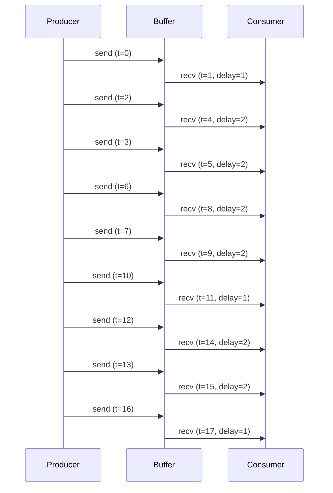
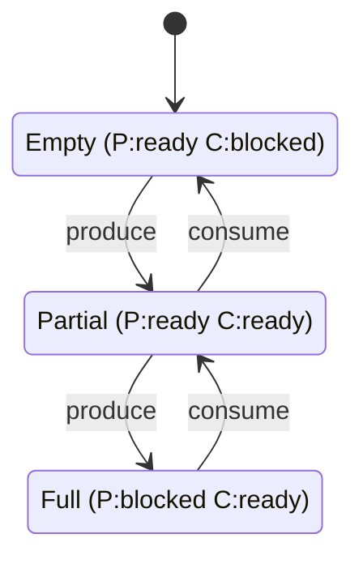

# Producer-Consumer CTL Verification

**Generated**: 2025-12-10 05:45:02  
**Tool**: kripke-ctl

---

## System Description

A producer-consumer system with bounded buffer:

- **Producer**: Creates items and sends to buffer
- **Consumer**: Receives items from buffer
- **Buffer**: Capacity = 2, FIFO
- **Blocking**: Producer waits when full, consumer waits when empty

## Engine Execution

| Step | Time | Action | Buffer | Events |
|------|------|--------|--------|--------|
| 1 | 1 | produce | 1 | 0 |
| 2 | 2 | consume | 0 | 1 |
| 3 | 3 | produce | 1 | 1 |
| 4 | 4 | produce | 2 | 1 |
| 5 | 5 | consume | 1 | 2 |
| 6 | 6 | consume | 0 | 3 |
| 7 | 7 | produce | 1 | 3 |
| 8 | 8 | produce | 2 | 3 |
| 9 | 9 | consume | 1 | 4 |
| 10 | 10 | consume | 0 | 5 |
| 11 | 11 | produce | 1 | 5 |
| 12 | 12 | consume | 0 | 6 |
| 13 | 13 | produce | 1 | 6 |
| 14 | 14 | produce | 2 | 6 |
| 15 | 15 | consume | 1 | 7 |
| 16 | 16 | consume | 0 | 8 |
| 17 | 17 | produce | 1 | 8 |
| 18 | 18 | consume | 0 | 9 |
| 19 | 19 | produce | 1 | 9 |
| 20 | 20 | produce | 2 | 9 |

## Event Log

- Total messages: **9**
- Average queue delay: **1.67 ticks**
- Maximum queue delay: **2 ticks**
- Consumer processed: **9 items**

### Event Timeline

## State Space

**States**: 3  
**Transitions**: 4

### States

- **buffer_0**: empty, P:ready
- **buffer_1**: P:ready, C:ready
- **buffer_2**: full, C:ready

### State Diagram

## CTL Verification

| Property | Formula | Result | Description |
|----------|---------|--------|-------------|
| Safety | `AG(¬overflow)` | ✅ | Buffer never overflows |
| Liveness-P | `AG(EF(producer_ready))` | ✅ | Producer can always eventually send |
| Liveness-C | `AG(EF(consumer_ready))` | ✅ | Consumer can always eventually receive |
| No-Deadlock | `AG(producer_ready ∨ consumer_ready)` | ✅ | System never deadlocks |
| Reachable-Full | `EF(buffer_full)` | ✅ | Buffer can become full |
| Reachable-Empty | `EF(buffer_empty)` | ✅ | Buffer can become empty |

## Summary

**Verification**: 6/6 properties passed

### Key Findings

1. ✅ **Safety**: Buffer never overflows
2. ✅ **Liveness**: Both actors can always make progress
3. ✅ **Deadlock-freedom**: System never gets stuck
4. ✅ **Reachability**: All buffer states are reachable

### Metrics

- Average queue delay: **1.67 ticks**
- Messages processed: **9**
