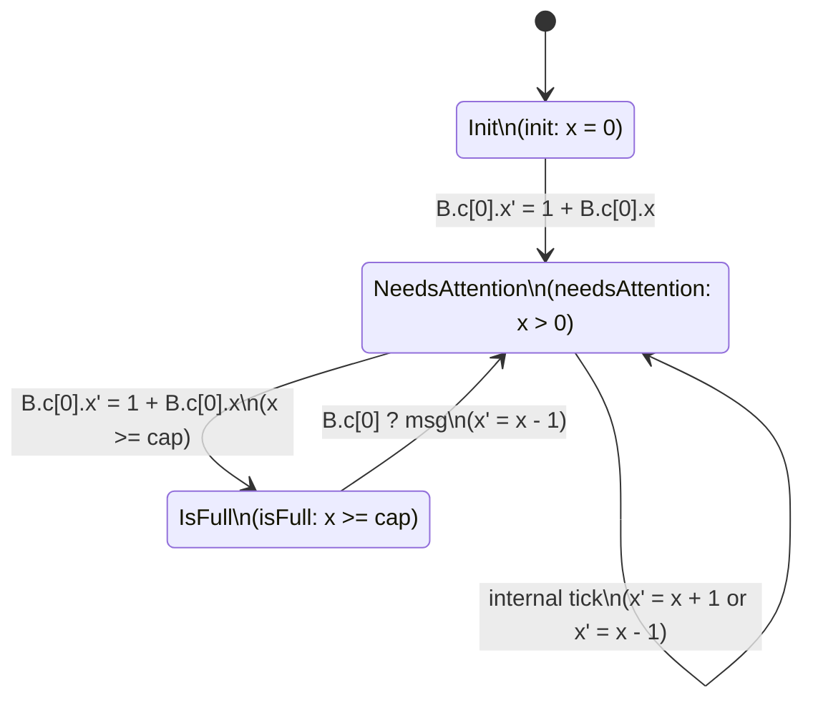

Scheduler rules
=============

```mermaid
flowchart TD
    A[Current World State S] --> B[For each actor A<sub>i</sub>]
    B --> C[Compute local predicates<br/>(init, needsAttention, isFull, ...)]
    C --> D[From each A<sub>i</sub>, collect candidate steps]
    D --> E[Filter steps:<br/>- Guard/predicate true<br/>- NOT send-to-full<br/>- NOT read-from-empty<br/>- For cap=0: require matching send/recv pair]
    E --> F{Any enabled steps?}
    F -->|No| G[Quiescent / deadlock]
    F -->|Yes| H[Pick exactly one enabled step at random]
    H --> I[Execute chosen step<br/>(mutate actor state, channels, emit events)]
    I --> J[New World State S']
    J --> A
```

FSM
====================

The state machines and interactions are related because reads and writes happen based on states we are in. Roughly each state is a machine instruction for a single varible change, send, recv, or write.


